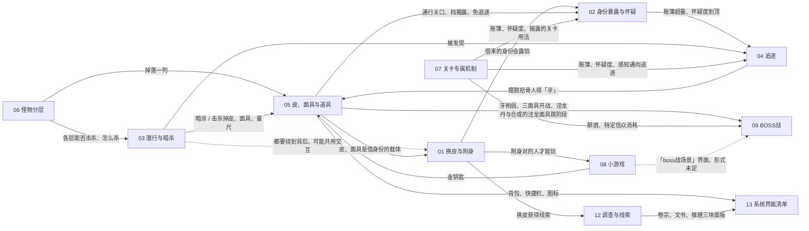
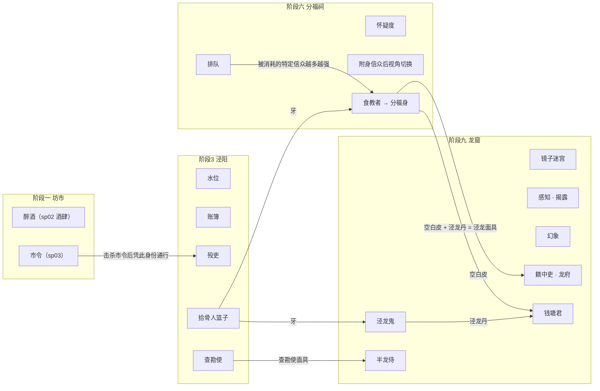

# 00·功能总览

*状态：草稿（由聚光灯策划拆出，待策划确认）　最后更新：2026.10.7　roadmap：S1–S8 索引*

> 本系列把 `docs/design/spotlight/`（飞书《2026gamejam聚光灯》转写）与 `PRP/monster-ai/prd.md` 里的玩法拆成一份一个的设计文档（01–13），本文是汇总与导航，不重复规则正文。
> **怎么读**：每条规则标 [原文] / [推断] / [待定]；各文档第 0 节是来源对照，第 9 节是待定与原文矛盾。引用写成 `[02] R12`、`[03] Q4`、`[05] §3`。
> **维护纪律**：飞书是真源，本系列不改原文；飞书更新、重拉 `spotlight/` 后，按各文档第 0 节找到受影响的规则回改。策划拍板一条 [待定] 后，请策划改飞书，再重拉同步，不要让本系列变成第二份真源 [推断]。

出处简称：sp00 = [00_飞书主页](../spotlight/00_飞书主页.md)，sp01 = [01_剧情大纲](../spotlight/01_剧情大纲.md)，sp02 = [02_阶段一设计文档](../spotlight/02_阶段一设计文档.md)，sp03 = [03_战斗阶段设计思路和怪物命名关系](../spotlight/03_战斗阶段设计思路和怪物命名关系.md)，sp04 = [04_美术需求表](../spotlight/04_美术需求表.md)，sp05 = [05_序章流程](../spotlight/05_序章流程.md)，sp06 = [06_怪物状态与交互设计文档](../spotlight/06_怪物状态与交互设计文档.md)，sp07 = [07_回合制作战文档](../spotlight/07_回合制作战文档.md)，sp图 = [`../spotlight/images/`](../spotlight/images/)，mai = [PRP/monster-ai/prd.md](../../../PRP/monster-ai/prd.md)（来源为 2026-09-17《26聚光灯——怪物状态与交互设计文档》，**该文档全文 2026-10-07 入库为 sp06，mai 降为该文的精简需求**）。各篇写的 sp03「阶段1 坊市」「阶段3 泾阳」「阶段六 分福祠」「阶段九个 龙窟」是 sp03 四个标题（「阶段1 暗杀场景 主要场景 坊市」等）的简写；sp04「第 N 行」指该表去掉表头后的第 N 条数据行。**sp06、sp07 是策划补交的 Excel 原件**（正文全在文本框里、图是嵌入图片），转写规则见 [`../spotlight/README.md`](../spotlight/README.md)。

## 1·功能清单

| 编号 | 功能 | 一句话（各文档第 1 节，缩写） | roadmap | 首次出现（阶段 / 场景） | 可承载模块（各文档第 7 节） | 待定条数 |
| --- | --- | --- | --- | --- | --- | --- |
| [[01]](01_换皮与附身.md) | 换皮与附身 | 本体很弱，靠附身或使用 / 持有皮、面具借别人的身份，继承身份 / 物品 / 记忆，拿到这个身份的能力与出入权限去解谜、通行 | S1 | 序章「驯服附身」（sp05）；阶段一戏班起（sp02 五场景附身）/ 阶段1 普通皮（sp03） | Taming、Disguise、Player、Monster、Dialogue、Narrative | 16 |
| [[02]](02_身份暴露与怀疑.md) | 身份暴露与怀疑 | 借来的身份会露馅：人物特性、核验关口、账簿、怀疑度、龙族揭露、警戒值六种；后果原文两说（变回原主死亡 / 触发追逐） | S2 | 阶段一戏班「乐正 · 音乐解谜区」（sp02）；序章「同盟扮演（回答+行为）」（[02] R11 [推断]） | Monster、Disguise、Player、Narrative、Dialogue、Mirror（冻结） | 14 |
| [[03]](03_潜行与暗杀.md) | 潜行与暗杀 | 本体打不过任何怪、挨打即击倒；避开视野潜行，绕到背后处决，用掉落的皮、面具、道具往下走 | S3 | 序章「潜行→暗杀」（sp05）；阶段1 坊市「暗杀场景」（sp03） | Monster、Player、Disguise、IsometricExploration、Mirror（冻结） | 15 |
| [[04]](04_追逐.md) | 追逐 | 账簿超数、怀疑度到顶、抢拾骨人篮子、龙族揭露 / 都统召唤都会招来追兵；摆脱或用道具免掉，被抓的后果原文未定 | S4 | 阶段3 泾阳（账簿、拾骨人，sp03）；mai 的通用追击不分阶段 | Monster、Player、Disguise、Narrative、Mirror（冻结） | 13 |
| [[05]](05_皮面具与道具.md) | 皮、面具与道具 | 皮与面具是身份载体，钥匙与一次性道具过关，材料能合成；多从击杀 / 暗杀得来，不少要跨阶段带着走 | S5 | 序章「能力面具1」（sp05）；阶段一金钥匙、衣服（sp02）/ 普通皮（sp03） | Inventory、Loot、Monster、Disguise、Dialogue、Quest | 17 |
| [[06]](06_怪物分层.md) | 怪物分层 | 每个战斗阶段的怪分 A 底层 / B 特定 / C 关键三层，按阶段整理成总表；sp02 那套另列 | — | 阶段1 坊市（sp03）；sp02 只有酒肆小怪与阶段一 BOSS | Monster、Loot、Inventory、Taming、Mirror（冻结）、Dialogue、CharacterPuppet | 15 |
| [[07]](07_关卡专属机制.md) | 关卡专属机制 | 每个潜行 / 迷宫阶段一两条本场景规则：醉酒；水位、账簿；排队、怀疑度、视角切换；镜子迷宫、感知、幻象 | S6 | 阶段一酒肆醉酒（sp02）；sp03 从阶段3 起 | IsometricExploration、Dialogue、Monster、Player、Mirror（冻结）、Taming、Narrative | 20 |
| [[08]](08_小游戏.md) | 小游戏 | 借对的身份才玩得成：戏班音乐解谜（sp00 改为点角色周围光点）、金银行打造；「boss战场景」只有名字 | S8 | 阶段一戏班、金银行（sp02） | 无小游戏模块；可借 IsometricExploration、Dialogue、Performance、Quest、Narrative、Loot、Inventory、Core/UI · Audio | 14 |
| [[09]](09_BOSS战.md) | BOSS战 | 序章与阶段一、六、九各有 BOSS；打法多未定，原文写好了绕开硬打的路：牙削弱、泾龙丹 / 泾龙面具跳阶段、少消耗特定信众 | S7 | 序章「boss战（机制？）」；阶段一 BOSS（sp02）/ 乐官等四个（sp03） | Monster、Player、Narrative、Dialogue、Performance、Loot | 16 |
| [[10]](10_两界与场景结构.md) | 两界与场景结构 | 妖界坊市与人间泾阳两张同构地图：一条街面一排店，楼梯连 2 / 2.5 / 3 层；不做室内；十二阶段分落两界 | — | 序章「现生→镜子→里世界」；阶段一坊市街面 | IsometricExploration、Core/Flow、Performance、Quest、Dialogue、CharacterPuppet、Session | 14 |
| [[11]](11_剧情流程与章节结构.md) | 剧情流程与章节结构 | 十二阶段往返两界：明面查泾阳旧案到钱塘龙君关进井底，另一条是寻妻；序章是玩法流程图，阶段一 / 三 / 六 / 九有战斗关 | — | 序章；全篇 | Narrative、Quest、Dialogue、Performance、Session、Core/UI 通知 | 17 |
| [[12]](12_调查与线索.md) | 调查与线索 | 收集两界的证词、文书、物证并比对：阶段一靠附身对话，之后靠名簿、归业簿、赈粮册、香火册「对不上」一路追下去 | — | 阶段一客栈、衣肆（sp02）；阶段二起文书 | Dialogue、Narrative、Quest、Inventory、Loot、Core/UI 通知、Mirror（冻结） | 11 |
| [[13]](13_系统界面清单.md) | 系统界面清单 | sp04 UI 表 27 行与小游戏界面 4 行逐项归属、工程现状；音游相关两行与「不另开音游界面」对不上 | — | 开机标题界面；全篇 | Core/UI、Session、Dialogue、Quest、Performance、IsometricExploration、Inventory、Loot | 13 |

合计待定 / 开放问题 195 条，其中冠「原文矛盾」的 22 条，去重后为 §5 的 15 条；各篇之间重复提问的不少（见 §9 第 18 条）。「可承载」只说形态接近，不代表已支持，缺口见各文档第 7 节；标「冻结」的 Mirror 是旧版照镜 demo，见 §8.2。模块一览见 [模块总览](../../modules/README.md)。

**2026-10-07 补交两份策划原件后**（sp06、sp07，见 §2.7、§2.8）：[03] 第 3.8 节新收 8 条规则（R35–R42）、[07] 收 3 条（R55–R57）、[09] 收 9 条（R40–R48）；[09] Q3「回合制作战文档缺失」**已解决**，[03] Q9 的按键部分已解决（F 键），[07] R10 的读法有了参照。**新开出 6 条待定**：[03] Q16–Q18、[07] Q21、[09] Q17–Q19（上表的「待定条数」列为入库前的计数，未随本次重算）。

## 2·来源对照矩阵

按各文档第 0 节汇总（正文另有零星引用未计）；「未拆」= 没有玩法内容或本系列没用到。

### 2.1 sp00 飞书主页

| 节 | 内容 | 落到哪几份 |
| --- | --- | --- |
| 剧情概要 | 只挂附件《大纲》 | 无正文（附件即 sp01） |
| 阶段一玩法设计 | 附件《战斗场景设计文档》（即 sp02）+「改动地方」：不做室内、NPC 站门口、室外规划掩体；音乐解密改为点光点、暂不新开音游界面 | 01、03、07、08、09、10、13 |
| 场景设计 | 妖界坊市、人间泾阳两张俯视图 | 10（另 03 R26 引俯视图上的「遮挡物」） |
| 美术需求 · 标题 | 「白色的可以不做」 | 13 |
| 美术需求 · 1 主线角色 | 12 人名单 | 11 |
| 美术需求 · 2 玩法角色 | 都知 … 小怪（醉酒的顾客）；角色参考.png | 06（角色参考图未拆） |
| 美术需求 · 3 模型 | 8 个建筑、地面、楼梯、山石、装饰物；两界建筑复用 | 10 |
| 美术需求 · 4 UI | 内嵌表 | 13（逐行），另见 sp04 |
| 美术需求 · 5 小游戏界面 | 「预计有3个左右场景：阶段一金银行、boss战场景」；金银行界面.png | 08、09、13 |
| 序章 | 画板（即 sp05） | 见 sp05 |
| 场景预览 | 场景预览.png；「mmorpg的一个POI，该区域内完成章节一」 | 10、11、13 |
| 讨论记录 · 主题 | 中式微恐志怪；傩戏+画皮+志怪；《古镜记》《补江总白猿传》等 | 01、03、05、08、09、10、11 |
| 讨论记录 · 叙事 / 世界观 | 明暗双线叙事，多单元故事；唐朝与现代双时间线切换 | 11 |
| 讨论记录 · 玩法循环 | 剥脸获得面具继承身份 / 物品 / 记忆；潜行暗杀 / 利用规则杀怪；本体弱、击倒；绕背处决；触发规则被发现、变回原主、死亡 | 01、02、03、04、05、07、09、11、12、13 |
| 讨论记录 · 参考 | 「唐朝历史」+ 讨论记录_参考图.jpg | 03 §2（读作红 / 橙视野扇形参考 [推断]） |
| 讨论记录 · 1. 问题 | 空 | 未拆（无内容） |
| 讨论记录 · 附件 | 另一份大纲（讨论记录版）、战斗阶段设计思路（即 sp03） | 见 sp01 附节、sp03 |

### 2.2 sp01 剧情大纲（十二阶段）

| 阶段 | 落到哪几份 |
| --- | --- |
| 阶段一 入镜（附件版） | 01、08、09、10、11、12 |
| 附：讨论记录版阶段一 | 09、11 |
| 阶段二 名册勘察 | 04、05、10、11、12 |
| 阶段三 验堤 | 02、04、06、07、11、12 |
| 阶段四 赈粮账 | 02、11、12 |
| 阶段五 实地勘察 | 05、09、11、12 |
| 阶段六 前往 | 02、05、06、07、11、12 |
| 阶段七 弥勒教 | 05、06、07、09、11、12 |
| 阶段八 找官 | 06、11、12 |
| 阶段九 找龙 | 03、04、05、06、07、09、11、12 |
| 阶段十 窃法 | 05、11、12 |
| 阶段十一 失人 | 10、11、12 |
| 阶段十二 结案 | 09、10、11 |

剧情句子全部汇总在 [11] 3.1 阶段总表；其余各篇只在第 6 节「与叙事的咬合」里引用。

### 2.3 sp02 阶段一设计文档（2026.8.22）

| 场景 | 落到哪几份 | 主要落点 |
| --- | --- | --- |
| 场景一 戏班（都知、乐正、学徒、音乐解谜） | 01、02、03、04、06、08、10、12、13 | [01] R15 能力表、[02] §3.2 人物特性、[08] 音乐解谜 |
| 场景二 衣肆（裁衣匠、顾客） | 01、02、03、05、06、07、10、12、13 | [12] R5 衣肆推理、[01] R9 柜台后不可附身 |
| 场景三 金银行（金银匠、官证、杂役） | 01、02、05、06、08、12、13 | [08] 打造、[05] 金钥匙 |
| 场景四 客栈 | 01、06、12 | [12] R3 线索枢纽 |
| 场景五 酒肆（顾客、阶段一 BOSS、醉酒） | 01、02、03、06、07、08、09、11、12、13 | [07] §3.2 醉酒与 R55–R57 战斗内醉酒、[09] §3.2 与 §3.9 回合制（R40–R48） |
| 图：阶段一_音乐解谜参考.png、阶段一_金银行界面.png | 08、13 | [08] R2、R12–R13 |

### 2.4 sp03 战斗阶段设计思路和怪物命名关系

| 阶段 | 落到哪几份 | 主要落点 |
| --- | --- | --- |
| 阶段1 坊市（暗杀场景：妖民、缄口侍、戏班 / 衣肆 / 金银行的怪、市令、药行；乐官、行首、知金银行都料、坊正） | 01、02、03、05、06、07、08、09、10、11、12 | [06] 表 3.2、[05] 道具总表、[09] §3.3 |
| 阶段3 泾阳（潜行场景：水位、账簿；溺者、户绝民、水痕影、殁吏、录事、拾骨人；老吏、查勘使） | 01、02、03、04、05、06、07、09、10、11、12、13 | [07] §3.3–3.4、[02] §3.4、[04] T1–T3、[06] 表 3.3 |
| 阶段六 分福祠（潜行场景：排队、怀疑度、祥和视角；信众、特定信众、执事、灰衣收入；食教者 / 分福身） | 01、02、03、04、05、06、07、09、10、11、13 | [07] §3.5–3.7、[02] §3.5、[09] §3.5 |
| 阶段九个 龙窟（迷宫场景：镜子迷宫、感知、幻象；水族、巡逻队、蜃师、都统、半龙侍、籍中吏；泾龙鬼、钱塘君） | 01、02、03、04、05、06、07、09、10、11、12、13 | [07] §3.8–3.10、[02] §3.6、[09] §3.6–3.7 |
| 文件名里的「怪物命名关系」 | 06 §6 | 正文没有展开，未拆（[06] Q11） |

### 2.5 sp04 美术需求表

| 分页 | 落到哪几份 |
| --- | --- |
| 主线角色（10 行） | 09、11、12 |
| 玩法角色（10 行） | 06、08、09、11 |
| 模型（22 行） | 03、08、09、10、12 |
| UI（27 行） | 13（逐行），另 05、07、08、09、10、11、12 引用 |
| 小游戏界面（4 行） | 05、08、13 |
| 表头注（单元格颜色未导出） | 13 |

### 2.6 sp05、图、mai

| 原文 | 落到哪几份 |
| --- | --- |
| sp05 序章流程（画板 + mermaid 转写） | 01、02、03、05、09、11；10 用其导出图 |
| sp图 场景预览.png | 10、11、13 |
| sp图 两张俯视图 | 10（另 03 R26） |
| sp图 序章流程.jpg | 10、11 |
| sp图 角色参考.png | 未拆 |
| mai 目标与边界 | 01、03、04、05 |
| mai 验收 1（巡逻节奏） | 03 |
| mai 验收 2–3（75° 扇区、红橙区、警戒升降） | 02、03、04 |
| mai 验收 4–5（潜行 / 伪装免察觉、互攻与死亡） | 03、04 |
| mai 6 行验收全部与 sp06 同源；[03] 第 3.8 节改引 sp06 原文 | 03、04、06 |

### 2.7 sp06 怪物状态与交互设计文档（2026.9.17，2026-10-07 入库）

| 节 | 内容 | 落到哪几份 |
| --- | --- | --- |
| P1 一、巡逻 | 行走 / 站立两套动画；每 7-10 秒随机停 2 秒（为方便刺杀） | 03（R35、R36）、04、06 |
| P1 二、警戒 | 75° 扇形、橙区 / 红区、1:3（暂定）、扇形不显示；警戒值匀速涨、4 秒满；脱离后匀加速 6 秒落零；1.1 倍速；玩家可见警戒值与表现形式可主题化 | 02、03（R14、R19、R37、R52）、04、06、13 |
| P1 三、敌对 | 奔跑动画；敌对区或警戒满进敌对；1.25 倍速；进入攻击范围即攻击；脱离警戒区 2 秒后转回满值警戒 | 03（R15、R38、R52）、04、06 |
| P1 四、攻击、受击和死亡 | 三个动画；受击立刻敌对；生命为 0 死亡 | 03（R39）、06、09 |
| P1 五、被处决（选择制作） | 被处决秒杀后播被处决动画；「选择制作」= 范围未定 | 03（R40、Q3）、05、06 |
| P2 交互设计 | 怪物背后按 **F** 处决（限部分怪物）；不分朝向的察觉范围（玩家不可见）里要潜行（踩静步）才不被察觉 | 03（R41、R42）、05、06 |

### 2.8 sp07 回合制作战文档（2026.8.22，2026-10-07 入库）

| 节 | 内容 | 落到哪几份 |
| --- | --- | --- |
| 战斗通用 · 一、进入战斗 | 偷袭（先手 + BOSS −20% 生命）/ 正面（先手）/ 被攻击（BOSS 先手）三种 | 03、04、09（R40） |
| 战斗通用 · 二、战斗过程 | 切独立战斗场景；界面元素（道具格 / 三招式 / 怒气槽 / 剩余回合 / 悬停详情）；玩家三招式的消耗与效果；施放后进敌方回合；道具在出招前用、每场每件一次 | 08、09（R41–R45、R48）、13 |
| BOSS 设计 · 阶段1BOSS | 继承战斗外醉酒值；醉酒值在血条下、状态在血条上；四档跳过回合（0/20/40/100%，酩酊 −50 持续 2 回合）；BOSS 三招式与 6:3:1 比例；招式 2 自饮酒 +30 醉酒、回血 10%、下次普攻 +30% | 07（R55–R57）、09（R46、R47） |

### 2.9 mai 与 spotlight/README 其余条目

| 原文 | 落到哪几份 |
| --- | --- |
| mai 验收 4（潜行 / 伪装免什么） | 01、02、03、04 |
| mai 验收 5（攻击、受击、死亡） | 03、04 |
| mai 验收 6（多端同一组动作、测试） | 未拆（工程验收项） |
| spotlight/README「整理者注」1–5 | 注 1、3 → 本文 §6；注 2 → [08] Q1、[13] Q1–Q2；注 4 → [03] §2；注 5 → **已消**（回合制作战文档 2026-10-07 补交） |
| spotlight/README「整理者注」6–7（2026-10-07 新增：醉酒两处写法对不上、处决与「本体弱」对不上） | [07] Q21；[09] Q1、Q17 |

## 3·功能依赖图

只画各文档第 5 节写过的关系；实线是原文写明的先后或产出，虚线是原文未定的关系。

### 3.1 功能之间

### 3.2 阶段、关卡机制与跨阶段道具链

依据：[11] R9 与 §5（跨阶段携带）、[05] §5（牙、空白皮、泾龙丹、泾龙面具）、[04] §5（牙）、[07] §5 与 [02] §5（各阶段挂哪些机制、特定信众消耗决定分福身强度）。阶段一挂哪套机制取决于 §6 的两套设计。

## 4·统一术语表

### 4.1 核心术语（照抄 [01] 术语表，定义归 [01]）

下表一字照抄 [01] 开头的术语表；表内 R、Q 编号指 [01] 的条目。

| 原文说法 | 出处 | 原文怎么用 | 本系列统一用法 [推断] |
| --- | --- | --- | --- |
| 剥脸 | sp00「讨论记录」 | 「主角通过剥脸获得面具，继承身份/物品/记忆进行解谜」：一个动作，产物是面具 | 只在转述 sp00 时使用，指「从角色身上取得面具的动作」。剥脸与 sp03 的「击杀 / 暗杀后掉落」是不是同一动作，暂按「同一类取得方式」理解，待定（Q1） |
| 换皮 | sp01「阶段一：入镜」 | 「通过换皮获得线索，五个场景后击败boss1」：阶段一整体玩法的统称 | **本系列的总称**：凡是「借用他人身份行动」的玩法（附身、使用皮、持有面具）统称换皮，本文标题即此义。附身与使用皮 / 面具是否同一机制，暂按「两种做法」理解，待定（Q1） |
| 附身 | sp02 戏班 / 衣肆 / 金银行 / 酒肆；sp03「阶段六 · 区域设想」 | 玩家对场景里一个在场的角色「附身」，之后以该角色行动，获得其能力与通行权限；同一场景可先后附身多人 | 指「对一个活着的角色发起、之后以该角色行动」的做法，不经过道具。被附身者附身期间和之后怎样，待定（Q4） |
| 驯服附身 | sp05「序章流程」 | 序章流程图里对「同类怪」的一条连线，之后分「战斗/扮演」 | 暂按「附身」在序章里的写法理解，与 sp02 的「附身」是否同一动作待定（Q5） |
| 收服 | sp03「阶段3 · A 底层怪物」 | 户绝民「可以被对应溺者刻度的湿皮收服」 | 保留原词，只用于户绝民；不并入附身（Q5） |
| 制服 | sp03「阶段3 · C 关键怪物 · 2 查勘使」 | 查勘使掉的面具「可直接制服老吏/进入可互动状态」 | 保留原词，指让关键 NPC 进入可交互状态；不并入附身 |
| 皮 | sp03 各阶段 | 击杀 / 暗杀后掉落的道具：普通皮、湿皮、殁吏皮、信众皮、执事皮、水族皮、空白皮；用来通行、伪装或合成 | 道具类别名，逐件定义见 [05](05_皮面具与道具.md)；写具体道具一律用原名 |
| 面具 | sp00「讨论记录」；sp03 各阶段；sp05「序章流程」 | 剥脸 / 击杀所得的道具：能力面具1、骨牙面具、灰衣面具、都统面具、蜃师面具、半龙侍面具、泾龙面具等 | 道具类别名，与「皮」分开记，不合并（原文同一阶段里两者并存）；两类在功能上有什么区别，待定（见 [05](05_皮面具与道具.md) 第 9 节） |
| 穿皮 | 原文无此词 | — | 本系列**不使用**这个词。用皮、面具时照原文的动词写：「使用」（普通皮「使用后」）、「持有」（查勘使面具、泾龙面具「如持有」）、「生效中」（执事皮） |
| 伪装 | sp03「阶段3 · B 特定怪物 · 1 殁吏」「阶段九个 · B 特殊怪物 · 籍中吏」；mai「验收 4」 | sp03：借皮或道具扮作某身份（殁吏皮「在废弃官署伪装为吏」，「使用泾龙丹进行伪装」）；mai：玩家可开关的一种状态，「伪装免于橙区警戒」 | 指「正以某个借来的身份示人」这一状态，不论来源是附身、皮、面具还是丹。它在怪物感知上的效果暂按 mai 的「伪装」理解，待定（R24） |
| 身份 | sp00「讨论记录」；sp02「场景二 衣肆」；sp03 阶段1 / 3 / 九 | 「继承身份」「上报自己的身份」「必须有特定身份可以进入」「使用的身份会被记录」「揭露玩家身份」「核验玩家身份」 | 玩家当前对外呈现的那个角色（某个被附身者，或某件皮 / 面具对应的角色） |
| 本体 | sp00「讨论记录」 | 「主角本体和怪物作战时……击倒」 | 没有借用任何身份时的主角 |
| 扮演 / 同盟扮演 | sp05「序章流程」 | 「战斗/扮演」「同盟扮演（回答+行为）」 | 以借来的身份应对他人（回答与行为），是 [02](02_身份暴露与怀疑.md) 暴露判定的对象 |
| 暴露 | sp02「场景一 戏班 · 一、角色 · 2. 乐正」 | 「被视为不符合人物特性，主角会暴露」 | **本系列统一用「暴露」指身份被看穿这一结果**，定义见 [02](02_身份暴露与怀疑.md) |
| 被发现 | sp00「讨论记录」；sp03「阶段六 · 区域设想」 | sp00「触发了规则的话就会被发现，从而变回原主」；sp03「就会被发现从而触发追逐战」 | 身份语境下按「暴露」理解；潜行语境下（怪物察觉玩家）按 [03](03_潜行与暗杀.md) 的定义 |
| 揭露 | sp03「阶段九个 · 区域设想」 | 龙族「会按一定规律揭露玩家身份」 | 保留原词，指阶段九由龙族定时发起的强制暴露 |
| 识破 | sp03「阶段九个 · A 底层怪物」 | 水族「可被随身镜交互识破」 | 保留原词，方向是**玩家识破怪物**；不用来说玩家被识破 |
| 变回原主 | sp00「讨论记录」 | 「从而变回原主，死亡」 | 照抄原词；谁变回谁，暂按「主角失去所借身份」理解，待定（见 [02](02_身份暴露与怀疑.md) 第 9 节） |
| 暗杀 / 处决 / 潜行刺杀 | sp00「讨论记录」；sp03 多处；sp05「序章流程」 | 「可以使用暗杀，绕到背后处决别人」 | 定义归 [03](03_潜行与暗杀.md)；本系列身份篇只借用「绕到背后」这一条与附身对照（R10） |

**统一用法小结** [推断]（照抄 [01]）：

1. **换皮**是总称；**附身**和**使用 / 持有皮、面具**是原文写明的两种做法，二者是否同一机制待定。
2. **皮**、**面具**是两个道具类别，各件道具用原名；两类的功能差别待定。
3. **身份**是被借用的角色；**本体**是没借用任何身份的主角。
4. **伪装**是借来的身份正在生效的状态；**暴露**是这个状态被看穿的结果。
5. 「穿皮」原文没有，本系列不用。

### 4.2 同物异名与同名异物（本文补）

「本系列口径」一列全部是整理口径 [推断]，不是策划裁定；是否同一物，以右列的待定问题为准。

| 原文说法 | 出处 | 本系列口径 [推断] | 待定见 |
| --- | --- | --- | --- |
| 福事 / 福肉 | sp03「阶段六」写「福事」；sp01「阶段六：前往」、sp04「UI · 关键道具图标」写「福肉」 | 玩法（排队、怀疑度、道具）写「福事」，剧情与 UI 写「福肉」，不合并 | [05] Q7、[07] Q15、[11] Q15 |
| 牙 / 龙牙 | sp03 阶段3 / 六 / 九写「牙」；sp01「阶段五」、sp04 关键道具图标与模型写「龙牙」 | 玩法道具写「牙」，剧情供奉物写「龙牙」 | [05] Q6、[09] Q9 |
| 钱塘君 / 钱塘龙君 / 钱塘之龙 | sp03「阶段九个 · C 关键怪物」写「钱塘君」；sp01「阶段九」、sp04 主线角色与模型写「钱塘龙君」；sp01「阶段十二」写「钱塘之龙」 | 转述 sp03 的 BOSS 战写「钱塘君」，其余写「钱塘龙君」 | [09] Q13 |
| B 特定怪物 / B 特殊怪物 | sp03 阶段1 / 3 / 六写「B 特定怪物」，阶段九个写「B 特殊怪物」 | 统称「B 层」；引原文照抄 | [06] Q13 |
| 分福祠 / 乡集祠堂 / 镜中乡集祠堂 | sp03「阶段六」主要场景「分福祠」；sp01「阶段六」「镜中长安的乡集祠堂」；sp04 模型「坊市·乡集祠堂」；场景预览.png「镜中乡集祠堂」 | 战斗关写「分福祠」，地图与建筑写「乡集祠堂」 | [10] Q4、[11] Q15 |
| 龙窟 / 龙府 / 洞庭府 | sp03「阶段九个」主要场景「龙窟」、籍中吏「在龙府门口」、分福身「通往第九阶段龙府」；sp01「阶段九」、sp04 模型、场景预览.png「洞庭府」 | 战斗关写「龙窟」，籍中吏把守的门照原文写「龙府」，建筑写「洞庭府」 | [10] Q4 |
| 里世界 / 镜中妖界 / 妖界 / 镜中 | sp05「里世界」；sp01「镜中妖界长安」；sp00「场景设计」「妖界」；sp04 UI 转场「镜中」 | 写「妖界」；「里世界」只在转述序章时用（[10] R20 读作即镜中妖界） | [10] Q7 |
| 现生 / 人间 / 现代 | sp05「现生」；sp00「场景设计」「人间」；sp00「讨论记录」「唐朝与现代双时间线切换」 | 写「人间」；「现生」只在转述序章时用，是不是「现代」线待定 | [11] Q9 |
| 阶段一 / 阶段1；阶段九 / 阶段九个 | sp01 用汉字编号；sp03 写「阶段1」「阶段3」「阶段六」「阶段九个」 | 引 sp03 照抄；叙述一律写阶段一 / 三 / 六 / 九 | [11] 3.2 |
| 章节 / 阶段 / 章节一 | sp04 UI「阶段一~阶段十二的章节名标题卡」；sp00「场景预览」「该区域内完成章节一」 | 写「阶段」；「章节」只用于界面 | [11] Q5、[13] Q7 |
| 阶段一BOSS / boss1 | sp02 酒肆、sp04 玩法角色「阶段一BOSS」；sp01「阶段一」「boss1」 | 写「阶段一 BOSS」，指 sp02 那套；与 sp03 的乐官、行首、知金银行都料、坊正分开记 | [09] Q4、[11] Q2 |
| 小怪（醉酒的顾客）/ 酒肆顾客 | sp04 玩法角色；sp02「场景五 酒肆 · 一、角色」 | 同一角色（[06] 3.6） | — |
| 学徒 / 店铺学徒 / 乐工、俳妓、学徒 | sp02 戏班；sp04 玩法角色「店铺学徒」；sp03「阶段1 · A 底层怪物」 | 照所在那套原文写 | [06] Q15 |
| 民众 / 仪式民众 / 弥勒教信众 / 信众 | sp04 主线角色「民众」「弥勒教信众（可用民众）」；sp00 美术需求「仪式民众」；sp03 阶段六「信众」 | 剧情群像写「民众」，战斗关怪物写「信众」 | [11] Q7、[12] Q10 |
| 女主 / 妻子 | sp00 美术需求、场景预览.png「女主」；sp01、sp04「妻子」 | 分开写，是否同一人待定 | [11] Q8 |
| 泾阳老吏 / 老吏 | sp01、sp04「泾阳老吏」；sp03「阶段3 · C 关键怪物」「老吏」 | 同一人（[06] §6） | [06] Q7 |
| 追逐 / 固定追逐 / 追逐战 / 追逐战斗 / 追击 | sp03 阶段3 / 六；mai「追击」 | 统称「追逐」，引原文照抄（定义归 [04] R29） | [04] Q6 |
| 驻地 / 驻守 / 守卫 / 守门 | sp03 各阶段 | 照原文；暂分两类见 [06] R7 | [06] Q3 |
| 警戒区域、敌对区域 / 橙区、红区 | sp02「场景五 酒肆」醉酒效果；mai「验收 2」 | 同一对概念（[03] R20） | — |
| 静步 / 潜行 | sp02 酒肆「无法静步」；sp00「潜行暗杀」；mai「潜行」 | 写「潜行」；「静步」照原文，二者关系待定 | [03] Q7 |
| 怀疑度 / 被怀疑的概率 | sp03「阶段六」区域设想、特定信众、灰衣收入 | 写「怀疑度」 | [02] Q4、[07] Q12 |
| 击杀 / 暗杀 / 击败 / 常规击杀 | sp03 各条 | 照原文；暗杀定义归 [03] | [05] Q16、[06] Q6 |
| 音乐解谜 / 音乐解密 / 音游 | sp02「音乐解谜」「下落式音游」；sp00「音乐解密」「音游界面」；sp04 UI「音游界面」 | 玩法写「音乐解谜」，界面写「音游界面」 | [08] Q1 |
| 过度平台 / 过渡平台 | 两张俯视图「过度平台」；sp04 模型「过渡平台」 | 写「过渡平台」（[10] R7） | — |
| 香火册 / 一册受着香火的册子 | sp04 模型、UI「香火册」；sp01「阶段五」 | 写「香火册」 | — |
| **同名异物**：账簿 | sp01「阶段四」「账簿上开始出现同一个名字领两份粮」（指赈粮册）；sp03「阶段3」区域设想「账簿」（记录玩家用过的身份） | 机制写「账簿」，剧情文书写「赈粮册」 | [12] Q11 |
| **同名异物**：收押 / 收服 / 制服 | sp01「阶段九」「收押带走」、「阶段十二」「已收押」（剧情结局）；sp03 户绝民「收服」、老吏「制服」 | 「收押」只是剧情结局，不是玩法（旧版的收押机制见 §7） | [09] Q12 |
| 镜子 / 随身镜 / 特殊镜面 | sp05「镜子」；sp03「阶段九个」「随身镜」「特殊镜面」「非特殊镜面」 | 照原文；是否同一面镜待定 | [05] Q15 |

## 5·跨文档原文矛盾总表

汇总 01–13 第 9 节冠「原文矛盾」的条目，去重后 15 条；只列不裁。

| # | 矛盾 | 出处 A | 出处 B | 见哪些文档的 Q |
| --- | --- | --- | --- | --- |
| C1 | 被发现之后：死亡还是追逐 | sp00「讨论记录」：触发规则「就会被发现，从而变回原主，死亡」 | sp03「阶段六 · 区域设想」「就会被发现从而触发追逐战」；sp03「阶段3 · 区域设想」账簿超量「触发固定追逐」 | [02] Q1、[04] Q1、[07] Q20 |
| C2 | 乐正能不能进音乐解谜区 | sp02「场景一 戏班 · 一、角色 · 2. 乐正」：能力「可以进行音乐解谜」，通行权限「除音乐解谜区」 | sp02「场景一 戏班 · 三、场景玩法」「然后附身乐正进行解谜」 | [01] Q10、[02] Q2 |
| C3 | 继承了记忆，却要自己分析来意 | sp00「讨论记录」剥脸「继承身份/物品/记忆」 | sp02「场景二 衣肆 · 一、角色 · 2. 顾客」附身后「分析自己是不是要取衣服」 | [01] Q3（相关 [12] Q1） |
| C4 | 本体打不过怪 vs 玩家可攻击怪 | sp00「讨论记录」「无法正面打败游戏内的任何怪物」，击倒期间「不能进行攻击」 | mai「验收 5」「玩家可攻击怪物」 | [03] Q1 |
| C5 | 挨打：击倒还是死亡 | sp00「讨论记录」怪物攻击「将主角击倒」，之后「只能缓慢移动」 | mai「验收 5」生命归零「死亡者停止行动」 | [03] Q2、[04] Q3（相关 [01] Q7、[02] Q14） |
| C6 | 背后处决、掩体做不做（范围差异） | sp00「讨论记录」「绕到背后处决别人」；sp00「阶段一玩法设计」「利用掩体潜行」 | mai「目标与边界」「背后处决、障碍物视线遮挡……不在首版」 | [03] Q3、Q4（[03] 记为范围差异，不算矛盾） |
| C7 | 序章的「正面战斗」 | sp05「序章流程」「战斗（正面？）」 | sp00「讨论记录」「无法正面打败游戏内的任何怪物」 | [03] Q5 |
| C8 | 不做室内 vs 进入店铺、酒肆 | sp00「阶段一玩法设计」「不做室内了，有室内的部分先改为npc站在该建筑门口」 | sp03「阶段1 · A 底层怪物」普通皮「使用后可以进入坊市店铺」；「阶段1 · B 特定怪物 · 1 酒肆」「必须有特定身份可以进入」 | [07] Q1（相关 [07] Q2–Q3、[10] Q8、[01] Q8、[03] Q12、[13] Q5） |
| C9 | 本体打不过怪 vs BOSS 战 | sp00「讨论记录」「无法正面打败游戏内的任何怪物」 | sp03 阶段六、阶段九的「击杀」「击败」「血量归零」，泾龙鬼「战斗难度极高」 | [09] Q1 |
| C10 | BOSS 战的形式 | sp02「场景五 酒肆 · 一、角色 · 2. 阶段一BOSS」「属于回合制战斗方式」 | sp04「UI」第 24 行 BOSS 血条「与音游界面叠加」；sp00「阶段一玩法设计」「暂时不新开一个音游界面」 | [09] Q2、[13] Q1、[08] Q11 |
| C11 | 音游界面与结算界面还要不要 | sp00「阶段一玩法设计」「暂时不新开一个音游界面」；sp02「场景一 戏班 · 二、音乐解谜」最后一键后「自动退出界面」 | sp04「UI」第 24 行「与音游界面叠加」、第 26 行结算界面「分数、最大COMBO、评价」 | [08] Q1、[13] Q2 |
| C12 | 阶段三在哪一界 | sp01「阶段三：验堤」「在镜中妖界找到人证」；场景预览.png 把阶段三列在妖界 | sp03「阶段3 潜行场景 主要场景 泾阳」，泾阳在场景预览与俯视图里是人间 | [10] Q2、[11] Q1 |
| C13 | 阶段一小游戏在哪 | sp04「模型」第 6 行「泾阳·金银行」：「阶段一小游戏场所」 | sp01「阶段一：入镜」、场景预览.png：阶段一在镜中妖界坊市 | [08] Q10、[10] Q11 |
| C14 | 主线角色几个 | sp00「美术需求」主线角色 12 人（含女主、乡中老人、仪式民众） | sp04「主线角色」10 行（「民众」，没有女主、乡中老人） | [11] Q7 |
| C15 | 当年情况由谁讲 | sp01「阶段五：实地勘察」「和乡中老人交谈当年情况」 | sp04「主线角色」第 5 行「民众」：「讲述当年灾情、坟地断新、分福仪式由来」 | [12] Q10 |

另有一批各篇没冠「原文矛盾」、但同属原文前后不一的条目，不进上表编号：两套阶段一设计、两版大纲阶段一（见 §6）；市令一处说「道具」一处说「此身份」、一处「暗杀」一处「击杀」（[06] Q6、[05] Q9、[01] Q14）；sp00「8个建筑」与模型表 18 条（[10] Q5）；钱塘君被称「最终boss」而阶段九不是最后一阶段（[09] Q16）；阶段九 sp01 写对质收押、sp03 写双形态 BOSS 战（[09] Q12、[11] Q6）；sp01 阶段十一先在妖界寻妻、场景预览只列人间（[10] Q14）；各处同物异名（§4.2）。

## 6·两套阶段一对照

依据：sp02（原文日期 2026.8.22）与 sp03「阶段1 暗杀场景 主要场景 坊市」；spotlight/README 整理者注 1、3。地点相同，角色、怪物与机制不同。本节只并排，不判断哪套作数；各格为原文转述，另注 [推断] 的除外。

### 6.1 逐个地点

| 地点 | sp02：角色 → 核心玩法 → 产出 | sp03：怪物（层级、数量）→ 写到的玩法 → 产出 / BOSS |
| --- | --- | --- |
| 戏班 | 都知、乐正、学徒 → 学徒身份进门，附身都知调走音乐解谜区巡逻的学徒，再附身乐正做音乐解谜（sp00 改为点角色周围光点）→ 解谜产出原文未写 | 乐工 / 俳妓 / 学徒（A·下，存在于戏班）；都知（B，巡逻，2-3）、乐正（B，驻地，3-4）→ 没写玩法 → BOSS 乐官（C）；掉面具 [推断] |
| 衣肆 | 裁衣匠（柜台后，无法绕背附身）、多名顾客 → 逐个附身顾客、对话推出唯一来取衣服的人，向裁衣匠上报 → 道具「衣服」 | 裁衣匠（B，驻地，2-3）、顾客（B，巡逻，3-4）→ 没写玩法 → BOSS 行首（C） |
| 金银行 | 金银匠、官证、杂役 → 附身官证改拨料文书，再附身金银匠在圆盘上打造 → 道具「金钥匙」 | 金银匠（B，驻地，2-3）、官证（B，巡逻，3-4）→ 没写玩法 → BOSS 知金银行都料（C） |
| 客栈 | 多名对话角色 → 对话中透露其他场景的线索 → 线索 | 没有出现 |
| 酒肆 | 顾客（最简单的怪物，固定巡逻轨迹）、阶段一 BOSS → 醉酒：附身怪物和其他怪对话，选对灌别人、选错被灌 → BOSS「属于回合制战斗方式」，击败后获得妻子位置（sp04） | 「最终目的地，必须有特定身份可以进入」，缄口侍（B，驻守）禁止随意进入 → 进去以后发生什么没写 |
| 官署 | 没有出现 | 坊正（C）：获得三个 boss 的面具后可开启战斗 → 通往酒肆的一次性钥匙 |
| 药行 | 没有出现 | 药师（B，驻地，2-3）→ 可以获取暗杀使用的药和特殊效果道具 |
| 全图 | 没有出现 | 妖民（A，随处可见，6-8）→ 掉普通皮，使用后进入坊市店铺、不可复用；市令（B，地图中巡逻）→ 交互获得怪物信息和线索，暗杀获得通行任何区域的道具（难度很高），阶段3 殁吏处可凭此身份通行 |

### 6.2 整体对照

| 项 | sp02 套 | sp03 坊市套 |
| --- | --- | --- |
| 场景定位 | 五个场景（戏班、衣肆、金银行、客栈、酒肆） | 「暗杀场景」，酒肆是最终目的地，戏班、衣肆、金银行是次级目的地 |
| 推进手段 | 附身、对话、小游戏 | 击杀 / 暗杀掉皮与面具，集齐三面具挑战坊正 |
| BOSS | 一个阶段一 BOSS（酒肆，回合制；「回合制作战文档」不在飞书本页内） | 乐官、行首、知金银行都料，加官署坊正 |
| 专属机制 | 醉酒（酒肆） | 没有「本区域设想」（[07] Q19） |
| 小游戏 | 音乐解谜、金银行打造 | 没有 |
| 追逐 | 没写 | 没写（[04] Q12） |
| 跨阶段影响 | 没写 | 击杀市令 → 阶段3 殁吏处凭此身份通行 |
| 同处挂着的原文 | sp00「阶段一玩法设计」把它作为附件挂出，「改动地方」（不做室内、音乐解谜改光点）写在它下面；sp04「玩法角色」10 行与它的角色一一对应；sp04「模型」两界都有客栈 | 挂在 sp00「讨论记录」下，与讨论记录版大纲同处；sp04「模型」没有官署、药行（[10] Q3） |
| 两版大纲阶段一 | 附件版：「接下泾阳旧案，进入镜中妖界长安」「通过换皮获得线索，五个场景后击败boss1，获得妻子的位置」「在坊市中找到妻子」——「换皮」「五个场景」「boss1」与 sp02 对得上 [推断] | 讨论记录版：「接下泾阳旧案，进入镜中妖界长安，在坊市中找到妻子」，没有五个场景与 boss1 |

### 6.3 需要策划拍板

1. 阶段一用 sp02、sp03，还是拼起来？若拼，sp03 的乐官、行首、知金银行都料是不是 sp02 戏班、衣肆、金银行三关的收尾？（[06] Q1、[11] Q3、[09] Q4）
2. 两版大纲阶段一以哪版为准；「boss1」是 sp02 的酒肆 BOSS 还是 sp03 的坊正？（[11] Q2）
3. 同名角色（都知、乐正、裁衣匠、顾客、金银匠、官证）在 sp02 是附身对象、在 sp03 是带数量的怪物：是同一批角色吗？sp03 那套里能附身吗？（[01] Q11、[06] §8）
4. 客栈（只有 sp02 有），官署、药行、市令（只有 sp03 有，模型表也没有官署、药行）各自去留。（[10] Q3）
5. 酒肆：sp02 是醉酒加回合制 BOSS 的场，sp03 是要特定身份或钥匙才进得去的终点，进去以后做什么？（[09] Q6）
6. 阶段3 殁吏「若阶段一击杀市令，可直接通过此身份通行」只在 sp03 套里成立；阶段一若用 sp02，这条通行方式怎么处理？（[05] Q9）
7. sp00 的两条改动（不做室内、音乐解谜改光点）是否也适用于 sp03 套？（[07] Q3）

## 7·与旧版策划对照

旧版指 `docs/design/features/`（照镜 / 收押 / 两界之账那一版，已冻结）。本节是本系列唯一提到旧版的地方，只读了旧版总览第 1 节与各篇标题。

| 旧版文档 | 一句话（旧版总览第 1 节） | 聚光灯里对应什么 | 说明 |
| --- | --- | --- | --- |
| [01 通灵视](../features/01_通灵视.md) | 雨、夜、昏暗时察觉「这里有东西」，只答有没有 | 无 | 聚光灯没有这类感知能力 |
| [02 照镜辨形](../features/02_照镜辨形.md) | 举镜照对象，镜回答它是什么；攻击与收押的前提 | 无（仅一处相近：阶段九随身镜识破水族，[02] R31、[07] R51） | 聚光灯里镜不是核心交互，只在阶段九出现一次 |
| [03 镜之耐久与镜碎](../features/03_镜之耐久与镜碎.md) | 被击溃时镜替挡、加裂纹，三裂镜碎重开 | 无 | 聚光灯挨打是「击倒」（[03] R3），失败是「变回原主、死亡」或追逐（§5 C1、C5）；工程里的镜碎页随 Mirror 冻结 |
| [04 收押](../features/04_收押.md) | 辨认成功、妖力削弱后关进镜里 | 无 | 聚光灯的「收押」只是剧情结局（钱塘龙君收押带走、关在井底，[09] R32）；户绝民「收服」、老吏「制服」也不是收押（§4.2） |
| [05 归还与扣押](../features/05_归还与扣押.md) | 对照见的存在做去处裁定 | 无 | — |
| [06 画皮傩演](../features/06_画皮傩演.md) | 收押过的妖的面皮制成傩面具，暂借记忆与本事 | [01] 换皮与附身、[05] 皮、面具与道具 | 同取「傩戏+画皮」主题；聚光灯不要求先收押，皮与面具靠附身、击杀 / 暗杀掉落或剥脸取得 |
| [07 两界之账](../features/07_两界之账.md) | 扣押一只妖族属记一笔，终局结清 | 无 | 聚光灯阶段3 的「账簿」记的是玩家用过的身份、超量触发追逐（[02] §3.4、[07] §3.4），同名不同物 |
| [08 追逐躲藏与弱点识破](../features/08_追逐躲藏与弱点识破.md) | 不打：逃脱、躲藏、识破弱点、利用场景 | [03] 潜行与暗杀、[04] 追逐；「弱点」近似 [09] 的牙削弱 | 两版都是「主角不正面打」；聚光灯多了绕背暗杀与身份暴露引发的追逐 |
| [09 镜中窥探](../features/09_镜中窥探.md) | 透过镜看现实之下的镜中长安，能看不能改 | 无（两界结构见 [10]） | 聚光灯的镜中妖界是能进去走动、战斗的另一张地图 |
| [10 疑案调查与信息](../features/10_疑案调查与信息.md) | 走、看、问、照拿信息，拼成判断再推进 | [12] 调查与线索 | 聚光灯以文书「对不上」为主线，阶段一靠附身对话 |
| [11 分支与结局](../features/11_分支与结局.md) | 章内选择改细节，终章三选一 | 无 | 聚光灯大纲只有一个结局「结案」（[11] Q14、Q16） |
| [12 断其去处](../features/12_断其去处.md) | 终章持镜送妖入轮回 | 无 | 聚光灯里「轮回」只在剧情里出现（轮回堂、妻子转生） |
| [13 妖的化形与破绽](../features/13_妖的化形与破绽.md) | 每只妖按同一张表定义化形、破绽、真形、执念、账 | 部分：[06] 怪物分层 | 聚光灯按阶段分 A / B / C 三层列怪，没有化形 / 破绽 / 执念表；水族在幻象里装成别的怪是唯一的「化形」（[07] R51） |
| [14 流程与章节结构](../features/14_流程与章节结构.md) | 章 → 幕 → 场线性推进，实界镜界交替 | [11] 剧情流程与章节结构、[10] 两界与场景结构 | 聚光灯是十二阶段，两界往返 |
| [15 叙事呈现](../features/15_叙事呈现.md) | 对白框 + 立绘、全屏演出与卷轴插图 | 部分：[13] 系统界面清单（对话框、字幕条、章节卡、转场） | 聚光灯原文没有专门的叙事呈现设计，只有 UI 表 |

roadmap 旧 G 组（G1 照镜辨形、G2 画皮傩演、G3 收押、G4 镜碎、G5 追逐、G6 结局）随旧版冻结；其中只有 G2、G5 在聚光灯里有对应（S1 / S5、S3 / S4）。

## 8·下一步

### 8.1 需策划先拍板的阻塞问题

这 12 条连同原文矛盾与细节待定，已整理成给策划填答复的 [待策划拍板问题](待策划拍板问题.md)。

按「不拍就没法开 PRP」的程度排序。

| # | 问题 | 卡住 | 出处 |
| --- | --- | --- | --- |
| 1 | 阶段一用哪套设计（sp02 五个附身场景 / sp03 坊市暗杀场景 / 拼），以哪版大纲为准 | S1、S3、S6、S7、S8 的阶段一内容全部悬着 | §6；[06] Q1、[11] Q2–Q3、[09] Q4、[08] Q12 |
| 2 | 附身与使用皮 / 面具是一套机制还是两套；附身的条件（绕背？潜行？）、被附身者怎样、怎么退出 | S1、S5 | [01] Q1、Q2、Q4、Q5；[05] Q1 |
| 3 | 身份暴露的后果：变回原主后死亡，还是触发追逐；死后从哪里重来 | S2、S4 | §5 C1；[02] Q1、Q3；[04] Q1 |
| 4 | 挨打的后果：击倒（多久、怎么起身）还是扣血死亡；本体能不能攻击 | S3、S4 | §5 C4、C5；[03] Q1、Q2、Q6；[04] Q3 |
| 5 | 暗杀放在哪一版（mai 首版不做背后处决）、交互是什么（一键 / QTE / 道具）、与附身怎么区分 | S3（以及 S1 的绕背判定） | §5 C6；[03] Q3、Q9（**按键已知为 F**，见 sp06；剩范围与动画） |
| 6 | 掩体与视线遮挡做不做；不做室内以后「进入店铺 / 酒肆」怎么落 | S3、S6、10 | §5 C6、C8；[03] Q4、Q8；[07] Q1、Q3；[10] Q8 |
| 7 | BOSS 战的形式（回合制 / 叠在音游上 / 有招式的动作战）和「本体打不过任何怪」怎么并存 | S7 | §5 C9、C10；[09] Q1、Q2、**Q17**（回合制适用范围）；~~补上回合制作战文档~~ **2026-10-07 已补交，见 [09] §3.9** |
| 8 | 音乐解谜用 sp02 原版还是 sp00 光点版；音游界面与结算界面去留 | S8 | §5 C11；[08] Q1、Q2；[13] Q2 |
| 9 | 账簿、怀疑度、揭露怎么计：数什么、阈值多少、会不会回落或清零、玩家看不看得到 | S2、S6 | [02] Q4、Q6、Q7；[07] Q10、Q12 |
| 10 | 道具规则：皮与面具的功能区别、一次性与持有型、合成后原料是否消失、背包怎么分类 | S5 | [05] Q1、Q2、Q3 |
| 11 | 「当前身份」、账簿、怀疑度、醉酒值、水位这些状态要不要上 HUD | S1、S2、S6 | [13] Q13；[07] Q16 |
| 12 | 阶段三在妖界还是人间（泾阳）；两界之间怎么切换 | S6（阶段3 关卡搭在哪张图）、10 | §5 C12；[10] Q2、Q7；[11] Q1 |

### 8.2 建议的精炼 / 开 PRP 顺序

先拍 8.1 的 1–6 条再开 S 项的 PRP；表格结构类的支撑项可以和拍板并行。「建议承载模块」只是形态接近，PRP 阶段再定。

| 步 | 项 | 依赖 | 建议承载模块 | 和现有工程的关系 |
| --- | --- | --- | --- | --- |
| 1 | [06] 怪物分层 → 怪物种类数据化（支撑） | 无硬依赖；表结构先做，内容等 8.1 #1 | Monster（种类表进 Luban） | Monster 现在全体共用一份 `MonsterConfig`、场景里只有一只怪；S3、S4、S7 都要按种类配数值、可否击杀、掉落 |
| 2 | S3 潜行与暗杀（[03]） | 8.1 #4、#5、#6；步 1 | Player、Monster | Player / Monster 本来就按聚光灯 2026-09-17 文档做的：巡逻、75° 扇区红橙区、警戒、敌对追击、攻击、生命都在；缺击倒、背后暗杀、视线遮挡（看拍板）。Player 现有普通攻击能打死怪，与「本体打不过」冲突（§5 C4） |
| 3 | [10] 两界与场景结构（支撑，与步 2 并行） | 8.1 #1、#6、#12 | IsometricExploration、Core/Flow（roadmap A4 多场景流转）、Performance（转场黑幕）、Session（场景键） | IsometricExploration 是 2.5D 灰盒场景栈，只有 SampleScene 一张；墙不挡人不挡视线，高度不影响判定。坊市街面灰盒可先搭 |
| 4 | S1 换皮与附身（[01]） | 步 2（绕背判定共用）；8.1 #1、#2 | Taming → 附身；Disguise → 「身份」状态；Player；Dialogue / Narrative 条件事实加「当前身份」 | Taming 是「切换操控」原型，最贴近附身，未接入正式流程，没有任何驯服条件、只支持一个敌人；Disguise 只是「伪装期间不被攻击」开关，没有身份概念 |
| 5 | S5 皮、面具与道具（[05]） | 步 2（掉落）、步 4（使用皮 / 面具即借身份）；8.1 #10 | Inventory、Loot、Monster（掉落） | Inventory / Loot 有背包白盒和拾取，道具类别是 Material / Consumable / Clue / Key，没有皮和面具，也没有使用、合成；Loot 只认物资箱，怪物死亡不掉东西 |
| 6 | S2 身份暴露与怀疑（[02]） | 步 4；8.1 #3、#9、#11 | Monster（警戒值层）、Narrative（遭遇仲裁、条件事实）、Dialogue（答错走另一个出口）、Player（死亡与重来） | 警戒值一层已有；规则层暴露、账簿、怀疑度、揭露都没有。Mirror（照镜 demo）随旧版冻结，目前玩家血量归零时弹镜碎页、重开本场，S2「暴露 → 死亡」落地时替换或删除；阶段九「随身镜识破」可能复用它 |
| 7 | S4 追逐（[04]） | 步 2（击倒）、步 6（触发源）；8.1 #3、#4 | Monster、Narrative | Monster 有敌对追击，但追击速度 2.5 低于玩家步行 3；没有寻路、召唤、集群巡逻队、脚本化的「固定追逐」 |
| 8 | S6 关卡专属机制（[07]） | 步 3、4、6、7；按阶段推进：阶段一（sp02 醉酒，或 sp03 无专属机制）→ 阶段3 水位、账簿 → 阶段六 排队、怀疑度、视角切换 → 阶段九 迷宫、感知、幻象 | 按机制分：Monster（醉酒缩区域）、Player（醉酒减速）、IsometricExploration、Narrative（计数类状态） | 现有模块没有任何一条；幻象要原样复用前三阶段的机制（[07] §8 约束 1），每条机制都要能挪到别的场景 |
| 9 | S8 小游戏（[08]） | 步 4（身份决定看到什么）；8.1 #1、#8 | 新开小游戏面板（Core/UI Panel），结果交 Quest / Narrative | 工程没有小游戏模块；音频资产为零（roadmap F4），sp02 原版音游没有音乐可放。阶段一不用 sp02 套时可整项搁置 |
| 10 | S7 BOSS 战（[09]） | 步 5（牙、面具、泾龙丹）、步 8（醉酒、特定信众消耗）；8.1 #7 | Monster（多阶段、形态切换）、Narrative（「战斗」阶段，结果回写待做 roadmap C5）、Performance（过场）、Dialogue（钱塘君战前交互） | 现在只有「生命归零倒下」；Monster 说明写战斗形态可能重做（旧版 G5，现归 S3 / S7）、倾向无血条，与 sp03「血量归零时转换阶段」和 sp04 BOSS 血条方向相反 |
| 旁 | [12] 调查与线索 | 步 4 | Dialogue、Narrative（剧情标记）、Quest、Inventory（已有线索类别） | Dialogue / Quest / Narrative 通用可用；缺「当前身份」条件事实，卷宗、文书翻阅、推理三块面板都没有 |
| 旁 | [11] 剧情流程与章节结构 | 8.1 #1；阶段一跑通后 | Narrative、Quest、Session、Performance | 通用可用；没有章节标题卡界面，没有真实章节内容 |
| 旁 | [13] 系统界面清单 | 随各 S 项 | 各 S 项自带 | 不单开 PRP：每个 S 项把 [13] 3.1 / 3.3 里对应的行带进自己的 PRP；加载过渡、地图、章节卡走 roadmap E4 与 A 组 |

### 8.3 与 roadmap 的关系

本系列是 [roadmap](../../roadmap.md) 第 3 节新增 S 组的设计索引——S1 换皮与附身 = [01]、S2 身份暴露与怀疑 = [02]、S3 潜行与暗杀 = [03]、S4 追逐 = [04]、S5 皮面具与道具 = [05]、S6 关卡专属机制 = [07]、S7 BOSS 战 = [09]、S8 小游戏 = [08]，06、10–13 是支撑文档不单列 S 项，旧 G 组随旧版冻结；roadmap 已于 2026-10-06 同步（第 3 节 S 组、第 5 节 W5）。

## 9·系列内部待统一

审稿结果。「处理」写「已改」的是本次在允许范围内直接改了 01–13；其余只列建议，留给下一波或策划。

| # | 问题 | 位置 | 处理 |
| --- | --- | --- | --- |
| 1 | 用「识破」说玩家被看穿，违背 [01] 术语表（「识破」只指玩家识破怪物） | [01] 术语表「暴露」一行、[01] 统一用法小结第 4 条、[01] §5 第 1 条、[02] R35 | 已改：四处「被识破」改为「被看穿」；§4.1 照抄的是改后版本 |
| 2 | 把食教者 / 分福身、泾龙鬼、坊正归为 BOSS 标成 [原文]；原文只把乐官、行首、知金银行都料写成 BOSS、钱塘君写成「双形态boss」，[09] R1 同一归类标 [推断] | [06] R5 | 已改：拆成 [原文]（C 层名单与原文写法）+ [推断]（两类划分与 BOSS 归类） |
| 3 | 「账簿的执行者是查勘使」标 [原文]；[04] R2 把同一连接（账簿超量 = 账簿追查）标 [推断] | [07] R23 | 已改：查勘使条原句保留 [原文]，连接部分改 [推断] 并指向 [04] R2 |
| 4 | 「已知的特殊道具有蜃师面具」标 [原文]；[05] 道具总表与 Q14 把「蜃师面具是不是那件特殊道具」列为推断 / 待定 | [07] R53 | 已改：蜃师面具的效果 [原文]，「即特殊道具」[推断]，其他特殊道具 [待定] |
| 5 | 「戏班、金银行是这五个场景中的两个」标 [原文]；把 sp01「五个场景」等同 sp02 场景一至五是推断（[01] R2、[10] R17 都标 [推断]） | [08] §6 第 1 条 | 已改：拆成 [原文]（sp02 场景）+ [推断]（等同 sp01 五个场景） |
| 6 | 「在里世界潜行、暗杀小怪」标 [原文]；sp05 里「潜行→暗杀」从「镜子」分出，不在「里世界」之后 | [11] §2 第 1 条 | 已改：按画板连线重写，「发生在里世界」改标 [推断]，指向 [10] R20 |
| 7 | 引文「人证泾阳老吏」不是原文（原文「找到人证，泾阳老吏」） | [11] 3.2 表阶段3 一行 | 已改 |
| 8 | 「对话是阶段一最主要的线索来源」「附身是取得线索的前提」两条结论标 [原文]，是从几句原文推出来的 | [12] R1、R2 | 已改：原句保留 [原文]，「最主要」「前提」两处改标 [推断] |
| 9 | Narrative 接入状态说法不一：[01]、[02]、[04]、[07]、[09] 写「未接进游戏」（依模块总览「未挂」）；[08]、[11] 写模块总览「未挂」、roadmap 2.2 写已接入 Boot | 各篇第 7 节 Narrative 行 | 已改（主窗口核实 Boot.unity）：01、02、04、07、09、08、11 第 7 节统一为「已接入 Boot（Boot.unity 挂 NarrativeInstaller），内容只有验证样例」；模块总览已同步为「已挂 Boot」 |
| 10 | Mirror 的一句话与现状写法各异：「照镜辨形：人 / 物 / 妖…」「照镜辨形、通灵视、镜裂、镜碎」「照镜辨形 demo」；[02] 写「是否已接进游戏未核实」 | [02]、[03]、[04]、[06]、[07]、[12] 第 7 节 | 不改。建议统一为「照镜 demo，随旧版冻结；玩家血量归零弹镜碎页、重开本场，S2 落地时替换或删除」 |
| 11 | 阶段一 BOSS 的「回合制作战文档」：[06] 写「该文档不存在」，[09] R6 写「不在飞书本页里，仓库里也没有」，spotlight/README 注 5 写「不在飞书本页内」 | [06] 表 3.6 阶段一 BOSS 行 | **已解决（2026-10-07）**：策划补交，入库为 [sp07](../spotlight/07_回合制作战文档.md)；[09] R6 与 Q3、spotlight/README 注 5、[06] 已同步；[08] Q11 / Q16 的「boss战场景小游戏」仍未定（[09] Q19） |
| 12 | 「sp02 里明确叫『怪物』的只有酒肆顾客」：sp02 戏班把学徒等写作「小怪」（都知「指派除了乐正之外的小怪」），[03] R30、[06] R11 也照此引用 | [06] R10 | 不改。建议 R10 补一句戏班的「小怪」 |
| 13 | 「遮挡物」是不是掩体：[03] R26 标 [推断]（应该就是掩体），[10] R11、Q9 标 [待定] | [03] R26、[10] R11 | 不改，两种标注都成立。建议以 [10] Q9 为准等策划答复 |
| 14 | 原文节点指针两种写法：行为组写 sp03「阶段1 · B 特定怪物 · 1 酒肆」，世界组写 sp03「阶段1 坊市」「阶段3 泾阳」等（sp03 标题的简写，原文没有这四个字面标题）；sp02 子项有「2. 乐正」「2 乐正」两种 | 01–07、09 对 08、10–13 | 不改（都能唯一对应）。本文页首已注明简写；建议下一波统一成行为组的写法 |
| 15 | 第 0 节简称说明两种：[01]、[02]、[05]、[08]、[10]–[13] 逐个带链接；[03]、[04]、[06]、[07]、[09] 写「sp00–sp07 = … 00–07 号文件」不带链接 | 各篇第 0 节首行 | 部分已改：01–07、09 的简称表已补 sp06、sp07（2026-10-07）；仍有「带链接 / 不带链接」两种写法，建议各篇照抄本文页首的带链接写法 |
| 16 | 规则 / 问题编号格式两种：01–07、09 用加粗「**R1**」「**Q1**」；08、10–13 用「R1　」（全角空格、不加粗） | 08、10–13 第 3、9 节 | 不改。建议统一加粗，方便检索与脚本统计 |
| 17 | 第 7 节首列两种：01–07、09 链到模块说明；08、10–13 只写模块名、链接放在第三列 | 各篇第 7 节 | 不改 |
| 18 | 同一个问题在多篇第 9 节重复提问，195 条 Q 去重后明显少于 195：福事 / 福肉（[05] Q7、[07] Q15、[11] Q15）、牙 / 龙牙（[05] Q6、[09] Q9）、醉酒算谁的（[01] Q13、[07] Q6）、柜台后不可附身（[01] Q8、[03] Q12、[07] Q2、[10] Q8）、市令道具与身份（[01] Q14、[05] Q9、[06] Q6）、乐正解谜区（[01] Q10、[02] Q2）、阶段三地点（[10] Q2、[11] Q1）、泾阳金银行（[08] Q10、[10] Q11）、BOSS 与音游界面（[08] Q1、Q11，[09] Q2，[13] Q1、Q2）、怀疑度口径（[02] Q4–Q5、[04] Q8、[07] Q12） | 各篇第 9 节 | 不改。§5、§8.1 已合并引用；建议策划按 §5、§8.1 编号答复，一处答复、多篇回填 |
| 19 | 「阶段一 / 阶段1」「阶段九 / 阶段九个」混写，有的篇照 sp03 原样、有的改成汉字 | 全系列 | 不改。口径见 §4.2：引 sp03 照抄，叙述写汉字 |
| 20 | 「钱塘君 / 钱塘龙君」各篇叙述时混用 | [04]、[05]、[06]、[09]、[10]、[11] | 不改。口径见 §4.2 |
