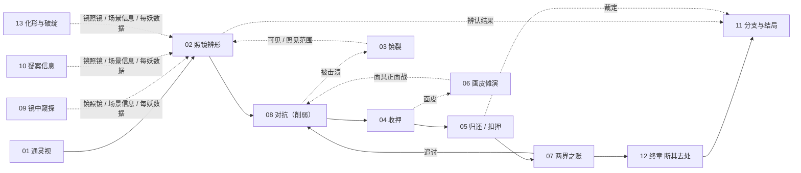

# 00·功能总览

*状态：草稿（由产品文档拆出，待策划确认）　最后更新：2026.9.28　roadmap：G1–G6 索引*

> 本系列把 `docs/design/product/` 三份产品文档与 `docs/design/story/第一章叙事架构与分支图.md` 里散落的玩法功能拆成一份一个的设计文档（01–15），本文是它们的汇总与导航，不重复规则正文。
> **怎么读**：每条规则标 [原文]（产品文档或剧情文档写了）/ [推断]（写手补的解读）/ [待定]（原文没说）；各文档第 0 节是来源对照（原句 → 本文哪条），第 9 节是待定与原文矛盾。本文引用写成 `[02] R12`（第 3 节规则号）、`[03] 9.1`（第 9 节第 1 条）、`[05] §8`（节号）。
> **维护纪律**：产品文档是真源，本系列不改原文；原文更新后按各文档第 0 节找到受影响的规则回改。策划拍板一条 [待定] 后，把它改成 [原文] 并回写产品文档，避免本系列变成第二份真源——这一条是建议 [推断]。

## 1·功能清单

| 编号 | 功能 | 一句话（各文档第 1 节，缩写） | roadmap | 首次出现 / 解锁 | 可承载模块（各文档第 7 节） | 待定条数 |
| --- | --- | --- | --- | --- | --- | --- |
| [01] | 通灵视 | 雨、夜、昏暗时隐约察觉"这里有东西"，只答有没有，"是谁"交给镜 | — | 先天；序章 P7 作为系统发放（[01] R9） | 无本体；IsometricExploration 作挂点 [推断] | 7 |
| [02] | 照镜辨形 | 举镜照对象，镜回答"它是什么"；攻击与收押的前提 | G1 | 序章 P2（[02] §6） | 无本体；可见范围落 Player / IsometricExploration | 8 |
| [03] | 镜之耐久与镜碎 | 被击溃时镜替挡、多一道不可修复的裂纹；三裂"镜碎"，重开 | G4 | 第一章二幕 B8 剧情裂痕（[03] R11） | 无本体；击溃触发落 Player；E6 镜碎页 | 9 |
| [04] | 收押 | 辨认成功 ＋ 妖力削弱后以镜的权柄关进镜里，族属记账 | G3 | 第一章（C5 支线或 D2，哪次算第一次待定，[04] §6） | Taming（雏形）、Narrative、Dialogue | 6 |
| [05] | 归还与扣押 | 对已照见的存在做去处裁定：关住、放回、归还、驱逐、轮回 | — | 第一章三幕 C8（龙）、四幕 D2（敬元颖） | Dialogue、Narrative、Performance | 7 |
| [06] | 画皮傩演 | 收押过的妖的面皮制成傩面具，暂借记忆与本事，代价是念头被渗透 | G2 | 第一章三幕 C5，前提是一幕支线收押（[06] §6） | Disguise（禁攻子集）、Player、Taming | 13 |
| [07] | 两界之账 | 每扣押一只妖族属记一笔；归还可销、摆渡人可免，其余变追讨、终局结清 | —（追讨落 G5） | 第一章建账、第二章追讨（[07] §6，[推断]） | Narrative、Monster（追兵） | 7 |
| [08] | 追逐躲藏与弱点识破 | 不打：逃脱、躲藏、识破弱点、利用场景；只有特定精英 / boss 借面具正面打 | G5 | 第一章 B8 / C7；首个追逐关第二章"讨债"（[08] R9） | Monster、Player、IsometricExploration、Disguise | 11 |
| [09] | 镜中窥探 | 通过镜看现实之下的"镜中长安"，能看不能改，除了照见与收押 | — | 第一章二幕 B5 首次进入（[09] §6） | IsometricExploration、Performance [推断] | 6 |
| [10] | 疑案调查与信息 | 走、看、问、照拿信息，拼成判断再推进；不告诉下一步、不提示哪个重要 | — | 序章 P1；P7 发放纸上备忘 / 镜中档案 | Dialogue、Quest、Performance、Narrative | 9 |
| [11] | 分支与结局 | 章内选择只改在场、台词、情报、生死；终章三选一，各得一样各失一样 | G6 | 章内序章 P2；结局入口第三章；选择在终章（[11] R9） | Narrative、Dialogue、Performance | 11 |
| [12] | 断其去处 | 终章继任摆渡人后持镜送妖入轮回，抹除记忆留在镜中，不可逆 | —（近 G6） | 规则第一章三幕 L1 教；机制终章（[12] §6） | Narrative、Performance | 6 |
| [13] | 妖的化形与破绽 | 每只妖按同一张表定义化形、破绽、真形、执念、账 | —（G1 / G3 / G5 数据前置 [推断]） | 序章 P3 照何素；第一章井中两妖 | Monster、CharacterPuppet、Taming | 10 |
| [14] | 流程与章节结构 | 章 → 幕 → 场线性推进，每章一桩疑案、一个指定疑问，实界镜界交替 | — | 全篇 | Narrative、Quest、IsometricExploration | 10 |
| [15] | 叙事呈现 | 对白框＋立绘讲日常，全屏演出与卷轴插图讲关键，不配音，主题靠行为落地 | —（对照 D1–D3） | 序章 P2 镜中空白 | Dialogue、Performance、CharacterPuppet | 8 |

合计待定 / 开放问题 128 条。"可承载"只说形态接近，不代表已支持（各文档第 7 节逐项写了缺口）。

## 2·来源对照矩阵

产品文档逐节 → 落到哪几份。"未拆"的节没有玩法内容，改它不需要同步本系列。

| 原文节 | 玩法相关内容 | 落到哪几份 |
| --- | --- | --- |
| 1_核心 §1 一句话概念＋项目表 | 潜行窥探现实与镜中长安、画皮、收服、志怪原型；时长、字数、分支规模定义、视角、呈现方式 | [01] [08] [09] [11] [13] [14] [15] |
| 1_核心 §2 类型定位 | 空节 | 未拆（原文空节） |
| 1_核心 §3 支柱 1 | 辨认为攻击前提、收押前提、不设血条、结局依赖辨认结果 | [02] [04] [08] [11] [13] |
| 1_核心 §3 支柱 2 | 两边都有理由、不分优劣、不强引导 | [05] [11] [12] |
| 1_核心 §3 支柱 3 | 一切服务于信息、画皮与弱点识破重在信息、放弃全知指引 | [01] [06] [08] [10] |
| 1_核心 §3 反面清单 | 六条，见第 6 节 | [05]–[08] [10] [11] [14] [15] |
| 1_核心 §4 体验目标＋情感峰值 | 每章指定疑问、三结局得失、结局 3 硬规则（完成所有鉴定）、五段情绪 | [02] [10] [11] [12] [13] [14] |
| 1_核心 §5 咬合表 | 照镜、收押、戴面具、归还 / 扣押、举镜自照五行心理 | [02] [04] [05] [06] [11] |
| 1_核心 §5 失败段 | 击溃即镜裂、"镜碎"页、可见范围缩减、三裂重开 | [02] [03] [08] [15] |
| 1_核心 §6 主题＋结局体系 | 核心问题 1 / 2、反派画皮更深、写作纪律（不说破、由行为落地）、三结局内容 | [06] [11] [12] [15] |
| 2_世界观 铁律 1 | 一身不二属、人一击溃散、面具是正面战唯一例外、强行引渡、父亲一瞬 | [03] [06] [08] [09] [12] [13] |
| 2_世界观 铁律 2 | 镜可照不可渡、耐久与次数、照见 / 收押两例外、摆渡人可渡、妖经镜面附身 | [02] [03] [04] [09] [13] [14] |
| 2_世界观 铁律 3 | 皮有旧主、身不由己、时限冷却、自愿归还离皮 | [05] [06] [15] |
| 2_世界观 铁律 4 | 扣押记账、归还销账、摆渡人豁免、追讨压力、终局要还 | [04] [05] [07] [08] [13] [14] |
| 2_世界观 铁律 5 | 镜不照主、自照空白 | [02] [15] |
| 2_世界观 铁律 6 | 不许以人情断律条、违者困死镜中 | [05] [11] [12] [14] |
| 2_世界观 §1 禁区 | 六条，见第 6 节 | [01]–[04] [08] [09] [12] [13] [15] |
| 2_世界观 §2 门 1 借体化形 | 附体化形、妖力外泄易被识破与收押 | [02] [04] [08] [13] |
| 2_世界观 §2 门 2 画皮傩演 | 镜识别 → 收押 → 面皮制面具、有限正面战、限时、每战一张 | [04] [06] [13] |
| 2_世界观 §2 门 3 断其去处 | 送入轮回、须摆渡人、记忆抹除不可逆、自愿例外 | [05] [12] |
| 2_世界观 §3 时间轴 | "玩家是否知道"一列决定揭示时机；混血来历 | [01] [10] [14] |
| 2_世界观 §4 体系本质 | 镜是判据只答问题、决定后不答、镜可继承面具不可、反噬梯度 | [02] [06] [09] [12] [13] |
| 2_世界观 §5A 律条·镜·摆渡人 | 律条刻镜背、摆渡人职责、父子传承 | [02] [07] [11] [12] |
| 2_世界观 §5B 两界管理者 | 妖由人死后成为、妖界账单 / 追讨 / 驱逐、无强制力 | [05] [07] [13] |
| 3_角色 §0 镜 | 镜答"这是什么"、答问与处置两权能 | [02] [04] |
| 3_角色 §1.1 崔映基础 | 可操作、"简单战斗"、随身备忘纸 | [08] [10] |
| 3_角色 §1.2 内在三件套 | 恐惧自照空白、镜"自己回来"秘密、底线落终章选择 | [01] [05] [11] [14] |
| 3_角色 §1.3 通灵视 | 看见不确认、有条件、非雷达 | [01] [02] [04] [08] [10] [13] |
| 3_角色 §1.4 弧光 | 无数值提升、终章翻镜 | [02] [06] [08] [12] [14] |
| 3_角色 §1.5 能力和代价 | 五种能力的来源、用途、代价、获得章节 | [01]–[07] [09]–[12] [14] |
| 3_角色 §1.7 关系表 | 第二章追讨、终章清账、结局时关系 | [07] [08] [11] |
| 3_角色 §1.8 出场清单 | 各章地点、疑案、第一次照镜 / 收押、终章三选一 | [02] [04] [07] [09]–[12] [14] |
| 3_角色 §1.9 立绘 / 表情 | 7 差分、照镜版、CG 五张 | [11] [15] |
| 3_角色 §2.1、§2.3、§2.5 崔昭 | 换嗓；一张一张戴皮、旧皮面具（画皮走到尽头的镜像）；数皮剩下的时辰（面具时限口径） | [06] [15] |
| 3_角色 §2.4 他会做什么 | 藏一条关键信息、真话但排序、收押 / 放归由他促成 | [04] [05] [10] |
| 3_角色 §3.1 崔皓基础 | 方相氏、四目面具（傩演渊源） | [06]（仅咬合） |
| 3_角色 §3.3、§3.4 崔皓 | "两种读法都成立"的写作纪律；困死镜中、不入轮回 | [12] |
| 3_角色 §4.1、§4.2 何素 | 全篇不被叫名、站门槛外；恐惧被识破和收押（化形风险的常驻样本） | [04] [13] [15] |
| 3_角色 §1.6、§3.5、§4.5 说话方式 | 文案纪律（"绝不会说"可做校验）；何素说话方式暗示后续有台词 | [15] |
| 3_角色 §2.2、§3.2、§4.3、§4.4 | 崔昭内在、崔皓内在、何素与崔昭、何素弧光 | 未拆（叙事 / 人物） |

## 3·功能依赖图

依据各文档第 5 节。"前置"指没有它本功能无法定义或无输入。

| 功能 | 前置（依赖） | 后继（被依赖） |
| --- | --- | --- |
| [01] 通灵视 | —（先天） | [02] [10]；与 [09] 划界 |
| [02] 照镜辨形 | [01] [03]（耗耐久）[10]（场景信息）[13]（真形数据） | [04] [06] [08] [09] [11] |
| [03] 镜碎 | [08]（击溃来源）[02]（耗耐久） | [08] [02]（可见 / 照见范围）[14]（重开单位）[15]（镜碎页） |
| [04] 收押 | [02]（辨认）[08]（削弱）[03]（耗耐久待定） | [05] [06] [07] [11] |
| [05] 归还与扣押 | [04] [02] [10] | [07] [06] [11] [12] |
| [06] 画皮傩演 | [02] [04] [13]（附体面皮） | [08]（面具战）[10] [11] [15]；与 [05] [07] 双向 |
| [07] 两界之账 | [04] [05] | [08]（追讨）[11] [12] [15] |
| [08] 追逐躲藏 | [03] [01] [13] [07] [10]；[06] 为例外入口 | [04]（削弱）[02]（引龙照己） |
| [09] 镜中窥探 | [02]（镜照镜入口） | [10] [15] |
| [10] 疑案信息 | [01] [02] [06] [09] | [02] [05] [08]（prep_level）[11] |
| [11] 分支与结局 | [02] [05] [07] [10] [12] [14] | 终点；呈现交 [15] |
| [12] 断其去处 | [05] [02] [07] | [11] |
| [13] 化形与破绽 | —（数据定义） | [01] [02] [04]–[08] [10] [12] |
| [14] 流程 | —（框架） | [03] [09] [10] [11] [15] |
| [15] 叙事呈现 | [02] [03] [06] [09] [10] [11] [14] | — |

主链实线、旁支虚线；[14] 流程与 [15] 叙事呈现是承载全图的框架，未画入。

## 4·统一术语表

| 术语 | 本系列口径 | 出自 | 状态 |
| --- | --- | --- | --- |
| 收押 | 动作：以镜的权柄把妖封进主角的镜里，完成即进入扣押 | [04] 术语表、R7 | [推断] 待拍板（[05] 9.1） |
| 扣押 | 状态：妖在镜中被关着，族属记账 | [04] 术语表 | [推断] 待拍板；与 [06] R2"妖仍在皮里"并存，见第 8 节 #5 |
| 放归 / 捞出 | 当场不收押，放回人间；不进镜、不入账 | [04] 术语表；[05] 去处表 | [推断] 待拍板 |
| 归还 | 对已扣押者事后改判，离镜 / 离皮，销账 | [04] 术语表；[05] R7–R8 | [推断] 待拍板；[06] 9.13 仍问是否同一操作 |
| 豁免 | 摆渡人免账，与归还不是一回事 | [05] R9；[07] R5 | 定义 [原文]，差别 [待定] |
| 驱逐 | C8 对龙的改判去处；§5B 又是妖界手段 | [05] R6；[07] R3 | [原文]，性质 [待定]（[05] 9.4） |
| 去处裁定 | 决定一个存在落在哪的判断本身 | [04] 术语表；[05] §1 | [推断] 待拍板 |
| 断其去处 / 送入轮回 | 门 3；终章摆渡人专属、不可逆 | [12] R1–R6 | [原文] |
| 章 / 幕 / 场 | 章＝序章、一至三章、终章；幕＝章内一段连续剧情，也是重开单位；场＝P1、A1…… | [14] R16 | [推断] 待拍板 |
| 关卡 | 1_核心 §5 用词，别处未定义；[14] 建议即"幕" | [14] R12；[03] 9.1 | [待定] |
| 通灵视 / 镜界层 / 镜中世界 | 三层：实界里的影子提示 → 同地叠加的另一层（S9）→ 镜照镜进入的独立空间（S7） | [01] §5；[09] §5 | [推断] 待拍板（[01] 9.2） |
| 镜中档案 | 镜界里的 UI 场景（S8），承载规则词条与账簿 | [09] R13；[10] R7；[07] R11 | 场景性质 [原文]，账簿归属 [推断] |
| 鉴定 = 辨形 | 1_核心 §4"完成所有鉴定"即照镜辨形 | [02] R14 | [推断] 待拍板 |
| 辨认成功 / 第四种结果 | 辨认成功＝用镜照见真形，只凭通灵视不算；第四种结果＝照镜得到"模糊的轮廓" | [04] R3；[02] R3、R6 | 前者 [推断]、判定标准 [待定]；后者 [原文] |
| 耐久 / 次数 | 铁律 2 的镜的限制，一量还是两量未定 | [03] R9；[02] 9.4 | [待定] |
| 裂痕 / 剧情性裂痕 / 镜碎 | 裂痕＝被击溃时镜挡出、计入三裂；剧情性裂痕＝脚本指定（B8）、不计入三裂；镜碎＝三裂后失败页，只有这两个字 | [03] R2、R3、R11 | [原文]；计数变量 [推断] |
| 削弱 | 收押第二前提；情境达成的状态，不是数值归零 | [04] R2；[13] R12 | [推断] |
| 硬分支 / 软分支 | 硬＝只在终章的三次结局分叉；软＝只改台词、细节、在场角色、情报量 | [11] R2–R3 | [原文] |
| 硬后果 | 本章不可逆的软分支，不改结局可用性；与硬分支不是一回事 | [11] R21；[05] §8 | [推断] 待拍板（[11] 9.1） |
| 污染 | 戴面具时妖的念头渗进主角 | [06] R9；[15] R5 | [原文]；表现 [待定] |
| 追讨 | 族属凭账找上门，以追逐 / 躲藏关呈现 | [07] R6–R8；[08] R9 | [原文] |

## 5·跨文档矛盾总表

15 份第 9 节里"原文之间"的矛盾，去重后 30 条。"谁拍板"不代表倾向。

| # | 矛盾 | 一端出处 → 说了什么 | 另一端出处 → 说了什么 | 涉及文档 | 谁拍板 |
| --- | --- | --- | --- | --- | --- |
| 1 | 重开单位 | 1_核心 §5 → 碎裂三次后重开**关卡** | story §3.2 → 三裂重开**本幕** | [03] 9.1、[08] 9.4、[14] 9.3 | 策划 + 程序 |
| 2 | 全篇体量 | 1_核心 §1 → 单周目 2–3 小时、3 万字 | story §1.1 → 第一章一章 5–6.5 小时、6–8 万字 | [14] 9.1 | 策划 |
| 3 | 第一章范围与叫法 | 3_角色 §1.8 → 序章与第一章并列；story §1.2 称"幕" | story 第一章＝序章＋四幕；§1.4 列头称"章" | [14] 9.2、9.4、[10] 9.7 | 策划 |
| 4 | 裂痕来源 | 1_核心 §5 → 只在被击溃、镜替挡时出裂纹 | 2_世界观 禁区、3_角色 §1.5 → 照镜耗耐久，每用一次裂痕风险累积 | [02] 9.3、[03] 9.2 | 策划 + 程序 |
| 5 | 剧情裂痕与计数 | story B8 → 第一道裂痕剧情性、不计入三裂 | story §3.2 → `mirror_shatters` 只有 0–1，读取方却写"潜行视野；三裂重开本幕" | [03] 9.4、9.6、[08] 9.2 | 策划 + 程序 |
| 6 | 击溃发生在哪一层 | 铁律 1 → 在妖界会被一击溃散 | story B8 → 击溃发生在实界的井（S6） | [03] 9.9 | 策划 |
| 7 | 龙那一笔账的措辞 | story D5 → "龙：未销，问。" | story §4.1 第 8 条、§4.4 → "龙：超支，问" | [07] 9.2、[11] 9.7、[13] 9.5 | 策划 |
| 8 | prep_level 档数 | story §3.2 → 低 / 中 / 高 三档 | story A9、§3.1 → 只有"现在下井 / 再查一天"两个出口 | [08] 9.3、[10] 9.5、[11] 9.8 | 策划 |
| 9 | 封龙四物第三件 | story C4、§3.1 分支树 → 拓片 | story C8 正文 → 刻字 | [10] 9.6、[13] 9.10 | 策划 |
| 10 | 主角能否进入镜中 | 铁律 2 → 不能把人送过去，摆渡人才可渡；禁区 → 无自由往返的普通人；3_角色 §1.5 → 终章继任；铁律 2 首次出现写"序章" | story B5、C6 → 第一章主角进入镜中世界；序章并无进入镜中的场 | [09] 9.1、9.6、[14] 9.6 | 策划 |
| 11 | 硬分支位置与软分支数 | 1_核心 §1、反面清单 → 硬分支只在终章，软分支 6 处 | story §1.1 → 第一章就有 4 处硬后果；§3.2 共 15 个变量 | [11] 9.1、[05] §8 | 策划 |
| 12 | 铁律首次出现章节 | 2_世界观 §1 → 铁律 4 第二章开头、铁律 6 第三章 | story §1.4 一幕"收押要记账"、D5 账簿；C8"铁律 6 在此被破" | [07] 9.1、[14] 9.5、[11] 9.6 | 策划 |
| 13 | 敬元颖收押得面具 | story §4.3 → 收押立即后果"面具＋账簿" | D2 正文只写"作为助手"；门 2 → 面具取附身动物 / 人之面皮，她是镜精 | [04] 9.4、[06] 9.9、[13] §4 | 策划 |
| 14 | 谁成为摆渡人 | 1_核心 §6 → 结局 1"作为摆渡人" | 1_核心 §4 → "接替父亲，成为摆渡人"是结局 3 的得失 | [11] 9.4、[12] 9.3 | 策划 |
| 15 | 通灵视生效条件 | 3_角色 §1.3 → 雨、夜晚、需要镜面、灯火昏暗 | story A4 → 雨、夜、灯火昏暗（无镜面） | [01] 9.1 | 策划 |
| 16 | 镜界层归属 | story §1.3 → S9 标"镜界" | story A4 → 镜界层与通灵视生效条件写在同一场 | [01] 9.2、[09] 9.2 | 策划 |
| 17 | "镜的三条"是哪三条 | story P2 分支 → 照物正常 / 照人正常 / 照自己空白 | story A7 → 规则词条含"它只给你看它已经知道的" | [02] 9.1 | 策划 |
| 18 | 照水面算不算失败 | story A2 → 窦叟列"照水面"为失败用法 | story P6、A5、A10 举镜照井水有结果；B5 照水入镜中 | [02] 9.2 | 策划 |
| 19 | 收押与扣押是一个还是两个动作 | 1_核心 §5 → "收押妖灵"与"归还／扣押"列两行 | story D2 → 收进镜里即扣押，对立面是捞出 | [04] 9.1、[05] 9.1 | 策划 |
| 20 | 收押归哪一门 | 2_世界观 §2 → 收押写在门 2 画皮傩演里 | 3_角色 §1.5 → 收押单列为镜的权柄，门 2 只含制面具 | [04] 9.5 | 策划 |
| 21 | 第一次收押与画皮是否必经 | 3_角色 §1.8、§1.5 → 第一章"第一次收押"、第一章获得画皮 | story C5 → 戴皮前提是可选支线收押；D2 可捞出——可能整章零收押 | [04] 9.3、[06] 9.12、[08] 9.7 | 策划 |
| 22 | 画皮在第一章的衔接 | story §4.3 → 戴皮延迟后果"D1 读镜背景"；§1.4 → 面具代价在二幕 L1 教 | D1 正文按收押记录读镜；二幕 B1–B14 无此场，首次戴皮在三幕 C5 | [06] 9.7、9.8 | 策划 |
| 23 | 正面战与画皮定位 | 铁律 1、反面清单 → 不戴面具不能正面冲突；支柱 3 → 画皮重在信息 | story C7 → 不戴皮也要进"战斗关卡"；3_角色 §1.1 → "简单战斗内容"；门 2 → 画皮是正面战唯一途径 | [08] 9.5、9.6、[06] 9.10 | 策划 + 程序 |
| 24 | 驱逐由谁行使 | 2_世界观 §5B → 驱逐是妖界的手段 | story C8 → 主角以镜改判驱逐 | [05] 9.4 | 策划 |
| 25 | 父亲是否有条件入轮回 | 铁律 6 → 在下一个摆渡人判决之前不入轮回 | §5A、3_角色 §3.4 → 被镜带走、困死镜中、不入轮回 | [12] 9.2 | 策划 |
| 26 | 门 3 反噬落在谁身上 | 门 3 代价列 → 被送者记忆抹除 | 2_世界观 §4 → "门三抹记忆"是执镜者"自我"损耗的一级 | [12] 9.1 | 策划 |
| 27 | 妖界的来源与强制力 | 2_世界观 §5B → 妖由人死后成为、有规则无强制力；禁区 → 无神明干预 | story §1.5 龙"生长宫房"、"被縻系的执法者"；B10 天将、太一使者 | [13] 9.1、9.4、9.6 | 策划 |
| 28 | 结局立绘与结局 CG | 3_角色 §1.9 → 立绘特殊版"结局版 3 张" | 同格 → "需 CG：三结局各 1" | [15] 9.1 | 策划 |
| 29 | 揭示与登场时机 | 3_角色 §1.2 → 镜"自己回来"第二章揭晓；§2 头注 → 崔昭第二章正式登场 | story §1.4 序章 L2 已列"镜自己回来的"；P4 崔昭亮相、A4 援手 | [14] 9.7、9.10 | 策划 |
| 30 | story 内部分支描述 | story D2 → 捞出报恩是"一条命"；分支树 → 阿菱二幕成第七个受害人 | §4.3 → 捞出后果"证词"，§3.4 两分支都进 D3；D8 四幕才呈现阿菱结果 | [05] 9.3、[11] 9.11 | 策划 |

只有一端、谈不上"矛盾"的缺口与歧义没有列入，照各文档第 9 节处理，主要有：耐久与次数是否一量（[02] 9.4、[03] 9.3）、1_核心 §4 缺第一章疑问（[10] 9.8、[14] 9.8）、结局硬规则作用范围（[11] 9.2）、"定-4／定-5"无解释（[11] 9.3）、何素为何也"看不真"（[01] 9.4、[02] 9.6、[13] 9.7）、妖界 / 镜中世界 / 镜界三个叫法（[09] 9.5）。

## 6·功能层设计约束清单

| 约束 | 出处 | 约束到哪几份（依据各文档第 8 节） |
| --- | --- | --- |
| 尽量避免正面强行战斗，精英 / boss 外以追逐、躲藏、弱点识破、场景利用对抗 | 1_核心 §3 反面清单 1 | [03] [06] [07] [08] |
| 不做开放世界 | 反面清单 2 | [09] [10] [14] |
| 不做强引导 | 反面清单 3 | [01] [02] [04] [05] [07] [10] [15] |
| 不做道德评判 | 反面清单 4 | [02] [04] [05] [07] [11] [12] |
| 不做配音 | 反面清单 5 | [15] |
| 硬分支上限 3 条且全在终章，不做中途分线 | 反面清单 6 | [05] [11] [12] [14] |
| 不可有神明直接干预 | 2_世界观 禁区 1 | [09] [11] [13] |
| 不出现随意转生，只能经摆渡人古镜 | 禁区 2 | [04] [12] [13] |
| 避免现代科学设定，借坊市、宵禁、傩仪、坊墙气质 | 禁区 3 | [13] [15] |
| 不出现能自由往返两界的普通人 | 禁区 4 | [09] |
| 不出现无代价的辨认手段，辨认须结合场景信息、付镜的耐久 | 禁区 5 | [01] [02] [06] [08] [10] [13] |
| 不出现人对妖的单方面碾压，强弱差双向 | 禁区 6 | [03] [04] [07] [08] [13] |
| 支柱 1 放弃普通正面战斗、数值成长；检验"是否让玩家多知道一点谁是谁" | 1_核心 §3 支柱 1 | 放弃：[02] [03] [04] [06] [08] [13] [14]；检验：[01] [02] [04] [08] [10] [13]–[15] |
| 支柱 2 放弃对选择的强引导、分支评判权重；检验"选项两边是否都有认同的理由" | 支柱 2 | 放弃：[05] [11]；检验：[05] [06] [11] [12] |
| 支柱 3 放弃全知型任务指引；检验"做完这个动作获得了什么信息" | 支柱 3 | 放弃：[01] [08] [10]；检验：[01] [03] [06]–[10] |

## 7·下一步

roadmap 第 5 节 W5：G1–G5 每项先玩法定义，再各开 PRP；策划写定义文档，`/refine-prd` 逐个精炼。G6 标"待内容"，C1–C3 做完后由剧本驱动。

**第一件事**：策划把第 5 节 30 条过一遍。其中 #1、#4、#5（重开单位、裂痕来源、剧情裂痕计数）直接卡 G1 / G4 的定义，#23 卡 G5，#13、#21 卡 G2 / G3，要先定。

G 行与文档一一对应（下表前两列）；各文档第 7 节已把 roadmap 该行"第一步"逐项对到本文位置。建议的 PRD 精炼顺序 [推断]，依据第 3 节依赖图：

| 序 | roadmap | 文档（并入） | 理由 |
| --- | --- | --- | --- |
| 1 | G1 | [02]（并入 [01]） | 依赖图的根：收押、画皮、弱点识破、结局解锁都读"辨认结果"；通灵视是同一条辨认链的前半 |
| 2 | G4 | [03] | 与 G1 共用耐久与可见范围，矛盾 #4 #5 要和 G1 一次定；E6 镜碎页随之 |
| 3 | G5 | [08] | 读 G4 的失败规则，产出收押的"削弱"；C5 战斗结果 → 剧情随之 |
| 4 | G3 | [04]（并入 [05]、[07] 写账侧） | 两个前提分别来自 G1、G5；裁定紧接收押，04 / 05 共用术语表 |
| 5 | G2 | [06] | 面具只能来自收押，依赖 G3；是否在 Disguise 上扩展此时再定 |
| 6 | G6 | [11]（并入 [12]） | 待内容；读前五项的全部状态，C1–C3 后由剧本驱动；断其去处只在终章、与结局绑定 |

其余非 G 文档去向 [推断]：

| 文档 | 去向 | 理由 |
| --- | --- | --- |
| [07] 两界之账 | 写账随 G3；追讨强度作 G5 输入；账簿界面第二章前单独小 PRP | 账本身跨章、跨三个功能 |
| [09] 镜中窥探 | 单独 PRP | 实界 / 镜界场景切换是独立工程，依赖 roadmap A4 world-scenes |
| [10] 疑案调查与信息 | 纸上备忘 / 镜中档案界面单独 PRP；其余是内容规范 | 调查流程已能用 Dialogue / Quest 拼，缺的是两个界面 |
| [13] 化形与破绽 | 纯内容规范，作 G1 / G3 / G5 PRD 的附件 | 定义的是数据而非动作 |
| [14] 流程与章节结构 | 纯内容规范；落地走 W2 的 C1–C3 | Narrative 阶段机承载 |
| [15] 叙事呈现 | 不需要新 PRP：D1–D3 与 E6 已覆盖，其余是文案 / 演出规范 | 缺口只剩污染视角（随 G2）与卷轴核实 |

## 8·系列内部待统一

写手之间的口径不一致（不是原文矛盾）。只列，不改；"建议归口"是 [推断]。

| # | 不一致 | 文档 A 说 | 文档 B 说 | 建议归口 |
| --- | --- | --- | --- | --- |
| 1 | "引龙照己"归哪类 | [02] R2：辨认作攻击手段的一例 | [08] R13、R15：弱点识破；[13] R12：龙的削弱方式（收押第二前提）——同一动作若既算辨认又算削弱，[04] R1 两前提会合一 | [08] 定义，[02] [13] 引用 |
| 2 | 潜行可见范围由谁定义 | [03] R6 自称定义方，[08] R6 引用它；[01] §5：裂痕不影响通灵视 | [02] R12 说照镜作用范围与潜行可见范围是同一个量 | [03] |
| 3 | 驱逐的主体 | [05] R6 与去处表：执镜者对妖的裁定，账另起一笔 | [07] R3：驱逐是妖界追讨手段 | [05] 定义，[07] 只记账 |
| 4 | 扣押中的妖在哪 | [04] 术语表：扣押＝妖在镜中被关着 | [06] R2、§5：妖仍在皮里，持有面具＝持续扣押 | [04] 术语表补一行 |
| 5 | 归还是否同一操作 | [04] 术语表：归还＝离镜 / 离皮，一个操作；[05] R7：归还后面具"失效" | [06] 9.13 仍问是否同一操作；[06] R11：面具"消失" | [05] |
| 6 | "辨认结果"指什么 | [02] R14、[13] §4：每只妖是否已照见真形（鉴定） | [11] R22：候选是 `jing_choice` 与收押记录（裁定与收押） | [02] 定义，[11] 读取 |
| 7 | 通灵视能否察觉化形 | [01] §5：被谁察觉、是否含通灵视 [待定] | [13] §5 [推断]：通灵视看见的就是化形泄出的妖力 | [01] |
| 8 | 敬元颖的削弱 | [04] 9.2：可读为 B5 镜照镜＝辨认、C8 放龙＝削弱 | [13] §4 填表备注：她不抵抗，可能不需要削弱 | [13] 数据表，[04] 引用 |
| 9 | jing_choice 的分支归类 | [05] §8：第一章裁定一律算软分支 | [11] §4：`jing_choice` 单列"核心选择"，不归软 / 硬，且是否计入结局解锁待定 | [11] |
| 10 | 重开单位的口径 | [14] R12、R16：建议统一为"幕"，自称定义方 | [03] R8、9.1 与 [08] 9.4 仍列为待定，未引用 [14] 的建议 | [14] 定单位，[03] 定规则 |

[01]: 01_通灵视.md
[02]: 02_照镜辨形.md
[03]: 03_镜之耐久与镜碎.md
[04]: 04_收押.md
[05]: 05_归还与扣押.md
[06]: 06_画皮傩演.md
[07]: 07_两界之账.md
[08]: 08_追逐躲藏与弱点识破.md
[09]: 09_镜中窥探.md
[10]: 10_疑案调查与信息.md
[11]: 11_分支与结局.md
[12]: 12_断其去处.md
[13]: 13_妖的化形与破绽.md
[14]: 14_流程与章节结构.md
[15]: 15_叙事呈现.md
