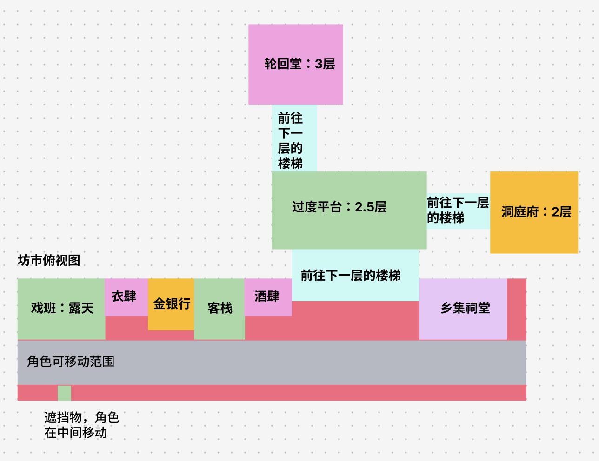
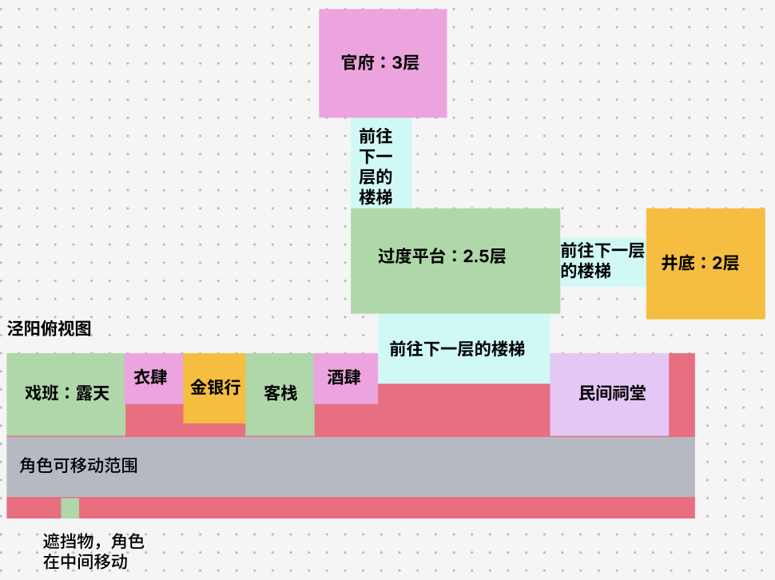
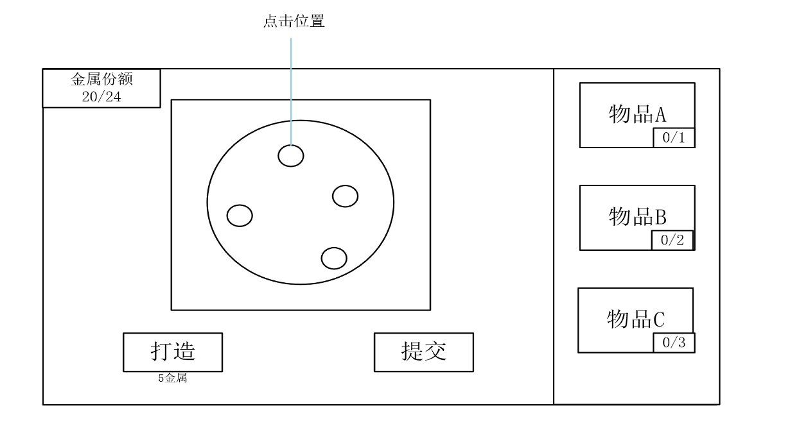
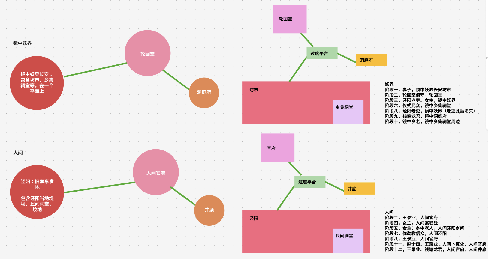
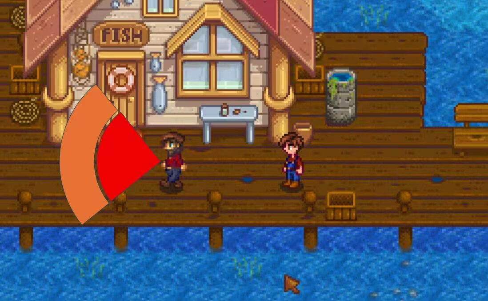

# 2026gamejam聚光灯 · 飞书主页

*来源：飞书 wiki「2026gamejam聚光灯」主页 · 拉取：2026-10-06 · 只搬不改*

## 剧情概要

📎 附件《大纲》→ [转写](01_剧情大纲.md)

## 阶段一玩法设计

📎 附件《战斗场景设计文档》→ [转写](02_阶段一设计文档.md)

改动地方：1. 不做室内了，有室内的部分先改为npc站在该建筑门口，NPC可以在一定范围内自由移动。后续会在外面规划掩体，玩家可以在室外利用掩体潜行。

1. 音乐解密改为交互后角色周围出现圆圈光点，点击消除。暂时不新开一个音游界面。

## 场景设计

妖界

人间

## 美术需求（白色的可以不做）

1. 主线角色：主角、妻子、轮回堂值守、泾阳老吏、仪式民众、镜中乡老、钱塘龙君、王录业、女主、乡中老人、弥勒教信众、赵十四。

📊 内嵌表格 → [04 美术需求表 · 主线角色](04_美术需求表.md#主线角色)

1. 玩法部分角色：都知、乐正、学徒、裁衣匠、顾客（多个）、金银匠、官证、杂役、阶段一BOSS、小怪（醉酒的顾客）

📊 内嵌表格 → [04 美术需求表 · 玩法角色](04_美术需求表.md#玩法角色)

（角色参考）

1. 模型：8个建筑、地面、楼梯、山石、建筑前面的装饰物（比如戏台前面有戏台椅子）。人间和妖界建筑复用，稍微修改就行，如果有时间建不一样的更好。

📊 内嵌表格 → [04 美术需求表 · 模型](04_美术需求表.md#模型)

1. UI

📊 内嵌表格 → [04 美术需求表 · UI](04_美术需求表.md#ui)

1. 小游戏界面设计，预计有3个左右场景：阶段一金银行、boss战场景

（阶段一金银行界面）

📊 内嵌表格 → [04 美术需求表 · 小游戏界面](04_美术需求表.md#小游戏界面)

## 序章

🧭 画板 → [05 序章流程](05_序章流程.md)

## 场景预览

定位：mmorpg的一个POI，该区域内完成章节一

## 讨论记录

主题

中式微恐志怪

傩戏+画皮+志怪

《古镜记》《补江总白猿传》等

叙事/世界观

明暗双线叙事，多单元故事

唐朝与现代双时间线切换

玩法循环

叙事/战斗/玩法

pve

主角通过剥脸获得面具，继承身份/物品/记忆进行解谜

主角可以潜行暗杀/利用规则杀怪

因为题材是偏恐怖，所以主角自身的力量非常弱，无法正面打败游戏内的任何怪物。主角本体和怪物作战时，怪物攻击主角会将主角击倒，击倒期间主角只能缓慢移动，不能进行攻击。可以使用暗杀，绕到背后处决别人。场景内有一些规则，如果触发了规则的话就会被发现，从而变回原主，死亡。

参考（游戏/美术/背景参考）

唐朝历史

1. 问题

📎 附件《大纲》→ [转写](01_剧情大纲.md#附讨论记录版另一份大纲docx)

战斗阶段设计思路和怪物命名/关系

📎 附件《战斗阶段设计思路和怪物命名关系》→ [转写](03_战斗阶段设计思路和怪物命名关系.md)
