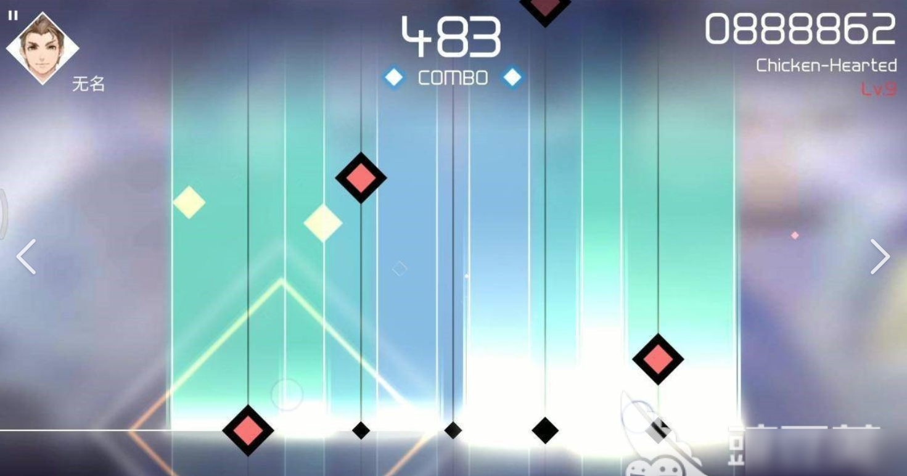
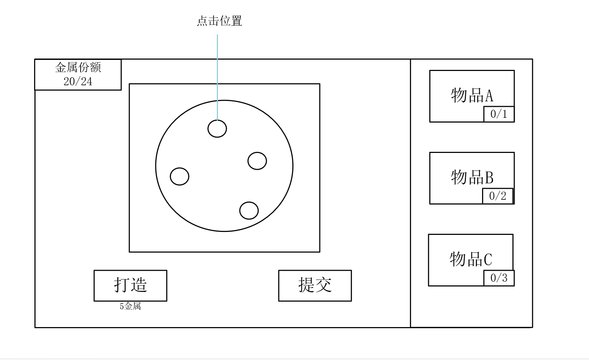

# 阶段一设计文档

*来源：飞书 wiki「2026gamejam聚光灯」主页『阶段一玩法设计』附件 战斗场景设计文档.xlsx · 拉取：2026-10-06 · 只搬不改*

原文日期：2026.8.22

## 场景一 戏班

### 一、角色

1. 都知

能力：都知是戏班的管理者。和小怪对话，可以指派除了乐正之外的小怪，改变他们的巡逻路线。（每一个小怪都有两种巡逻路线）

通行权限：可以出入戏班内的所有位置

2. 乐正

能力：乐正熟知音乐，可以进行音乐解谜。在音乐解谜玩法内，只有乐正可以看到正式的玩法表现形式，都知和学徒看到的都是混乱的。

通行权限：除音乐解谜区,可以出入戏班内的所有位置，如果在音乐解谜区被其他人发现，即被视为不符合人物特性，主角会暴露

3. 学徒

能力：作为戏班里的最普通成员，没有其他特殊能力，只能跟其他人对话交流信息

通行权限：可以出入戏班内的所有位置

### 二、音乐解谜

简单的下落式音游，五条轨道，游玩时长约1分钟

其他人观看这个解谜会出现错误的按键，按照错误按键按下去的话不会有反应

当玩家点击正确时，会在上图对应圆圈范围内出现圆形粒子特效，播放结束圆圈消失。最后一个按键点击正确时，出现特殊特效，范围更大，颜色更鲜艳，然后自动退出界面。

当玩家点击错误时，圆圈和下面的按键提示会左右抖动一次表示错误。

### 三、场景玩法

玩家先通过学徒人物进入戏班，找到都知，然后使用都知能力，调动音乐解谜区巡逻的学徒到其他地方，然后附身乐正进行解谜

## 场景二 衣肆

### 一、角色

1. 裁衣匠

在柜台后，玩家无法绕到背后进行附身

2. 顾客

附身顾客可以和裁衣匠还有其他顾客对话，分析自己是不是要取衣服。可以和裁衣匠上报自己的身份，说自己要取衣服。

### 二、场景玩法

场景内有多名顾客，玩家可以分别附身这些顾客，并且通过对话分析出，这些顾客里只有一个人是来取衣服的，找到正确的人然后取走道具“衣服”

## 场景三 金银行

### 一、角色

1. 金银匠

能力：可以打造金属制品

2. 官证

能力：金银行每天按官方文书给金银匠拨金属，附身官证可以修改拨料文书，给金银匠更多的金属份额

3. 杂役

能力：作为金银行里的最普通成员，没有其他特殊能力，只能跟其他人对话交流信息

### 二、场景玩法

玩家附身官证，修改文书中给金银匠拨料的量，然后附身金银匠，用多出来的金属份额打造金钥匙

玩家附身金银匠，花费金属份额点击打造按钮，连续点击金属进行打造，玩家需要打造金钥匙和其他金银匠需要打造的金属首饰，最后打造完成提交，带出道具金钥匙

## 场景四 客栈

场景内多名角色用来对话，对话中透露其他场景的线索

## 场景五 酒肆

### 一、角色

1. 顾客

场景内最简单的怪物，有固定的巡逻轨迹

2. 阶段一BOSS

属于回合制战斗方式，详见回合制作战文档

### 二、特殊机制

醉酒：在酒肆内。玩家和所有怪物都拥有醉酒值，玩家可以附身怪物并和其他怪对话（这里可以有一些对话上的选择，对话选择正确让玩家能去灌怪物的酒，反之则是被怪物灌酒）

醉酒值：酒肆内其他小怪：20

玩家：100

BOSS：100

每次饮酒会增加10醉酒值，且醉酒值无法下降，在距离酒肆过远后，醉酒值清零

玩家醉酒效果：移动速度下降，无法静步

BOSS和小怪醉酒效果：移动速度下降，警戒区域和敌对区域范围缩小

全文完，感谢阅读！
