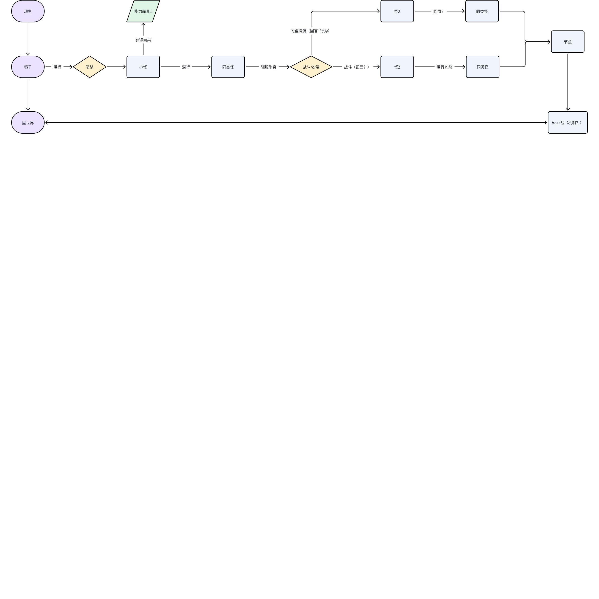
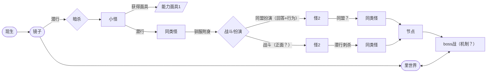

# 序章流程

*来源：飞书 wiki「2026gamejam聚光灯」主页『序章』画板 · 拉取：2026-10-06 · 只搬不改*

```mermaid
flowchart LR
  xs(["现生"]) --> jz(["镜子"])
  jz --> lsj(["里世界"])
  jz -->|"潜行"| as{"暗杀"}
  as --> xg["小怪"]
  xg -->|"获得面具"| nm1[/"能力面具1"/]
  xg -->|"潜行"| tlA["同类怪"]
  tlA -->|"驯服附身"| zd{"战斗/扮演"}
  zd -->|"同盟扮演（回答+行为）"| g2a["怪2"]
  g2a -->|"同盟？"| tlB["同类怪"]
  tlB --> jd["节点"]
  zd -->|"战斗（正面？）"| g2b["怪2"]
  g2b -->|"潜行刺杀"| tlC["同类怪"]
  tlC --> jd
  jd --> boss["boss战（机制？）"]
  lsj <--> boss
```

画板原样，带问号处为原文未定。
