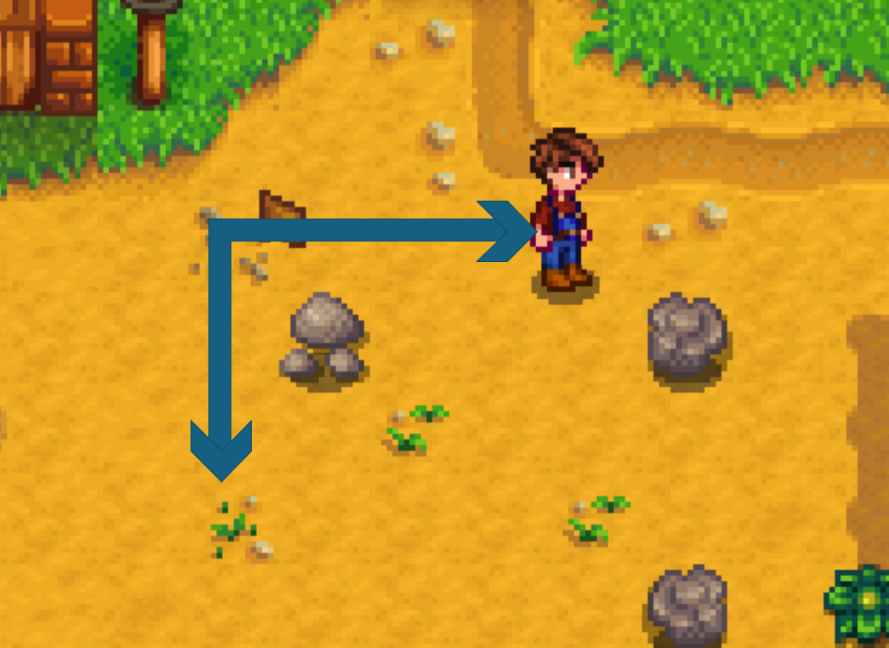
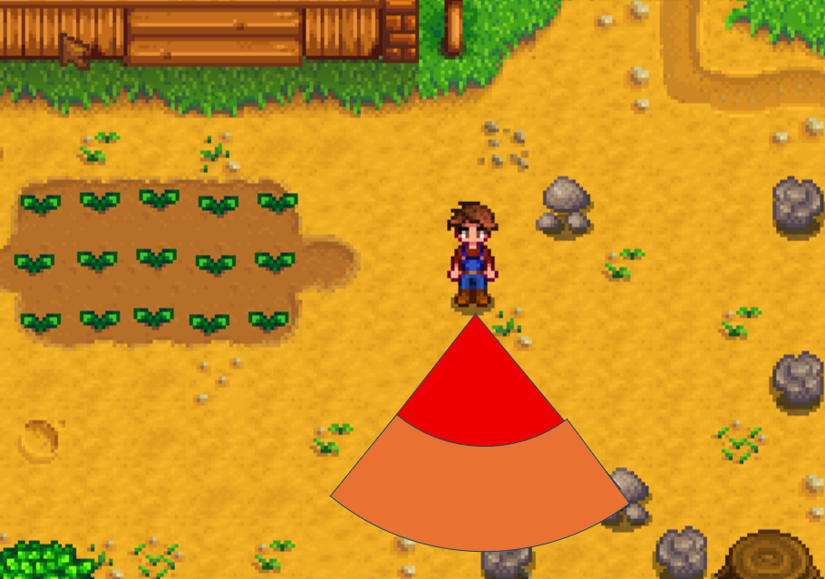
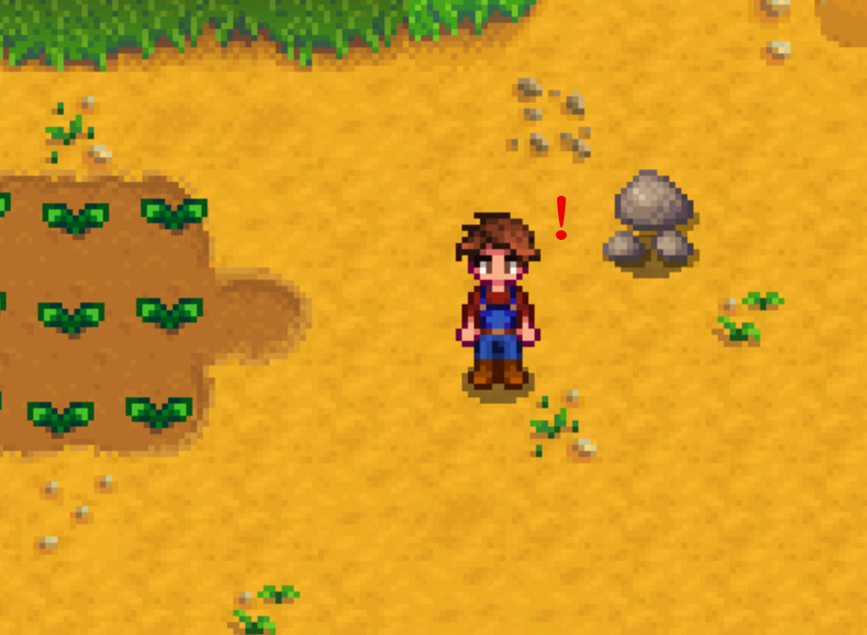
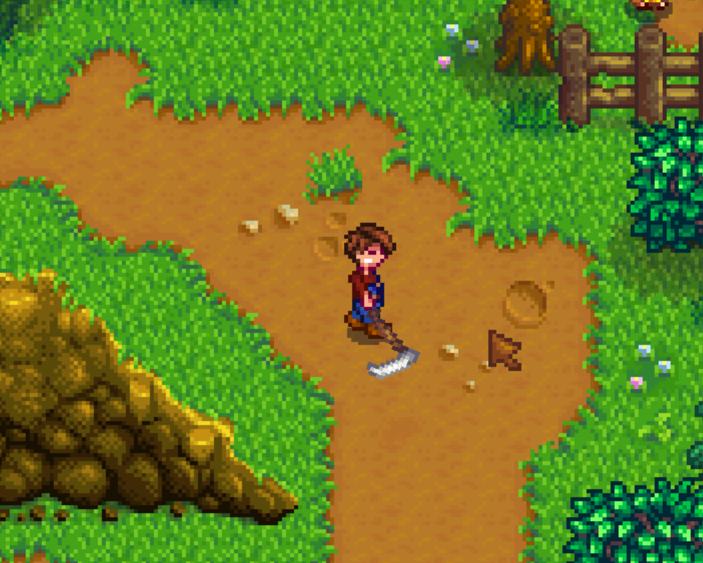
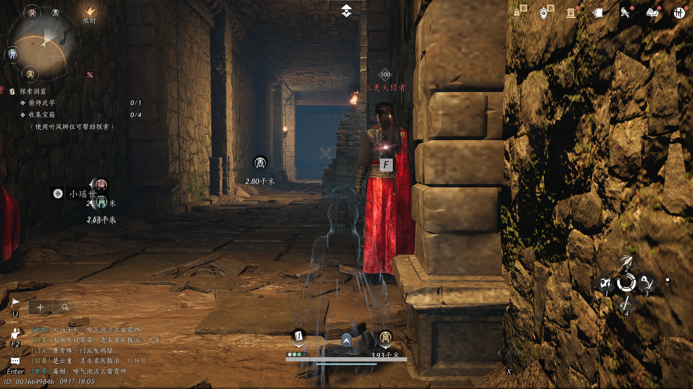
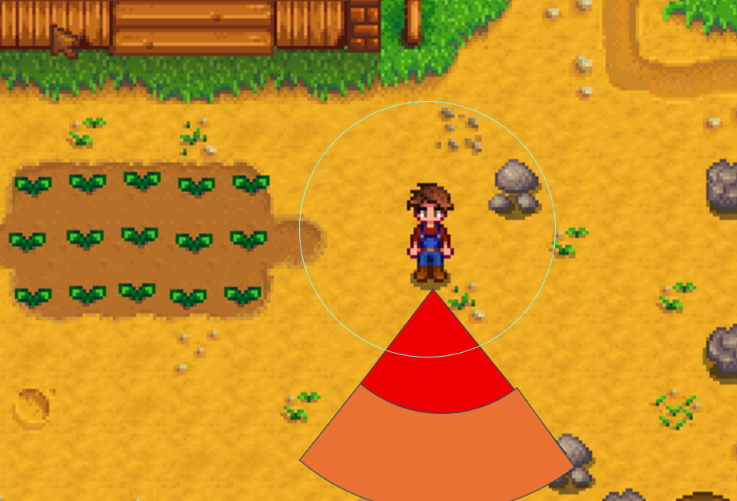

# 怪物状态与交互设计文档

*来源：策划原件《26聚光灯——怪物状态与交互设计文档.xlsx》（[source/26聚光灯-怪物状态与交互设计文档.xlsx](source/26聚光灯-怪物状态与交互设计文档.xlsx)）· 原文日期：2026.9.17 · 只搬不改*

原表正文分 P1 怪物状态、P2 交互设计两部分，全部写在文本框里、单元格没有文字；本节按原表的从上到下、从左到右顺序取出，标题与换行保留、文字未改（含「对于部分怪物。」这样的句号、多余空格）。图是原表嵌入的示意图，位置即原表位置。

## P1 怪物状态

### 一、巡逻

巡逻分为行走和站立2个动画

图中箭头为巡逻路径，怪物沿指定轨迹进行循环移动，行走循环的过程中每7-10秒（随机7，8，9，10），怪物随机切换为站立状态2秒   （为了方便玩家进行刺杀）

### 二、警戒

警戒为行走动画

怪物正前方的扇形区域分为警戒（橙色）和仇恨（红色）区域，当未伪装状态的玩家进入橙色区域，会使怪物进入警戒状态，处于警戒状态的怪物在行走时不会切换为站立状态。同时怪物会向玩家移动，增加移动速度为原行走速度的1.1倍

扇形为75度，敌对区域和警戒区域的半径长度比例为1：3（暂定）

扇形区域不会在游戏内显示

警戒值：玩家处于怪物的警戒区域内时，会匀速提升怪物的警戒值（玩家可见，表现形式可以根据剧情主题进行制作）

当玩家处于警戒区域4秒，警戒值会达到满值并进入敌对状态

在怪物处于警戒状态时，玩家脱离警戒区域会使怪物警戒值匀加速下降，警戒值满值需要6秒下降为0，随后怪物行走回到巡逻的轨道，变为巡逻状态

### 三、敌对

敌对为奔跑动画（如果时间不足也可以改为行走动画）

当玩家进入怪物的敌对区域或怪物警戒值满值会进入敌对状态

敌对状态怪物移动速度为原移动速度的1.25倍，玩家进入怪物的攻击范围后怪物会进行攻击

在玩家脱离警戒区域的2秒后，怪物将进入满警戒值的警戒状态

### 四、攻击、受击和死亡

分别为攻击动画、受击动画和死亡动画

玩家进入怪物攻击范围且怪物处于敌对状态时，会触发怪物的攻击

怪物受到攻击后会立刻进入敌对状态

怪物受到攻击后生命值为0则会死亡

### 五、被处决（选择制作）

怪物被玩家处决秒杀之后会进入被处决的动画

## P2 交互设计

对于部分怪物。玩家可以在怪物背后按F处决

怪物会对靠近的玩家有所察觉，在一定区域内（图中⚪内，玩家不可见），玩家需要进入潜行状态（踩静步）才不会被怪物察觉

全文完，感谢阅读！
