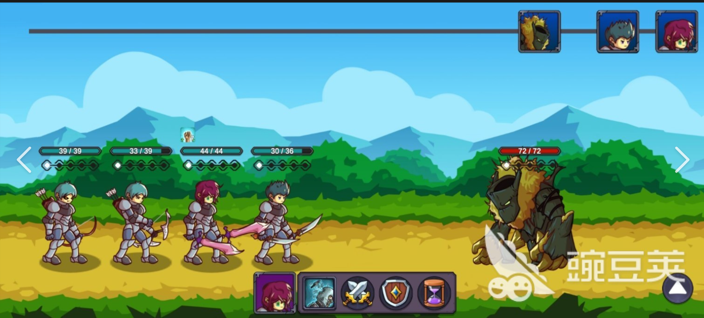
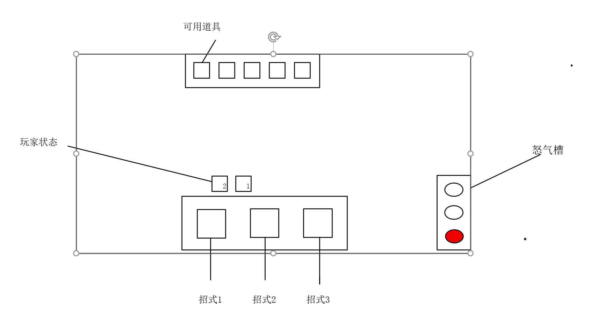
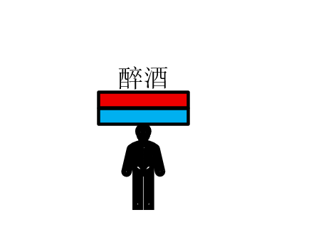

# 回合制作战文档

*来源：策划原件《回合制作战文档.xlsx》（[source/回合制作战文档.xlsx](source/回合制作战文档.xlsx)）· 原文日期：2026.8.22 · 只搬不改*

内页标题《BOSS战斗设计文档》。原表正文分「战斗通用」（一、进入战斗；二、战斗过程）与「三、BOSS设计」（1. 阶段1BOSS）两部分，正文全部写在文本框里，本节按原表的从上到下、从左到右顺序取出，小标题与换行保留、文字未改（`一、进入战斗` 这类编号是原文的；`战斗通用` 是原文的文本框分组）。图是原表嵌入的示意图，位置即原表位置。

> [02 阶段一设计文档](02_阶段一设计文档.md) 场景五 酒肆写「属于回合制战斗方式，详见回合制作战文档」，指的就是这一份。

## 战斗通用

### 一、进入战斗

玩家共有三种进入战斗的方式

1. 玩家偷袭攻击

触发条件：玩家潜行并偷袭怪物成功，玩家攻击BOSS，进入战斗
触发效果：玩家获得先手攻击权，BOSS生命值减少20%

2.玩家正面攻击

触发条件：玩家处于怪物警戒区域或敌对区域内，或怪物正处于警戒状态或敌对状态，玩家攻击BOSS，进入战斗
触发效果：玩家获得先手攻击权

3. 玩家受到攻击

触发条件：玩家处于怪物警戒区域或敌对区域内，或怪物正处于警戒状态或敌对状态，玩家被BOSS攻击，进入战斗
触发效果：BOSS获得先手攻击权

### 二、战斗过程

在进入战斗后，玩家进入新的战斗场景中

1. 画面表现

在招式有足够怒气可以施放时，招式格显示高亮，否则置暗
在怒气值满时，怒气槽颜色会更鲜艳
道具如可以使用则高亮，用过了则置暗；如果未拥有或在之前战斗时用过了，则不显示
玩家状态右下角显示剩余回合
玩家状态、招式和道具，鼠标悬停到上面会弹出详细信息

2. 战斗规则

招式：玩家共三个招式，都只能在自己回合使用

招式1：无消耗，使用后增加1点怒气；玩家闪身到敌人身前直接攻击,造成伤害，攻击结束退后到原本位置

招式2：消耗1点怒气；玩家闪身到敌人身前蓄力重击，造成伤害并减少对方50%治疗效果，攻击结束退后到原本位置

招式3：消耗3点怒气；玩家重击（最好有特殊动画）直接刺入敌人身体，造成伤害，并且玩家接下来的3次攻击附带额外伤害，攻击结束退后到原本位置

玩家在施放招式后，进入敌方回合

玩家可以在施放招式之前使用道具

## 三、BOSS设计

### 1. 阶段1BOSS

BOSS机制：

BOSS在进入战斗时，会继承战斗场景外的醉酒值，并且在战斗中会有各种状态，醉酒值需要在怪物血条下面显示，怪物状态要在怪物血条上方显示（玩家没有醉酒值，但是有状态）

状态1：正常状态，0-49，该状态无特殊效果，不需要在怪物头顶显示
状态2：微醺，50-79，该状态在怪物回合时，有20%概率跳过回合，此时出现屏幕中央闪现提示：怪物处于微醺状态，本回合无法行动。
状态3：薄醉，80-99，该状态在怪物回合时，有40%概率跳过回合，此时出现屏幕中央闪现提示：怪物处于薄醉状态，本回合无法行动。
状态4：酩酊，100，该状态在怪物回合时，怪物100%跳过回合，且醉酒值下降50，持续2回合。此时出现屏幕中央闪现提示：怪物处于醉酒状态，本回合无法行动。

BOSS在进入战斗时，会继承战斗场景外的醉酒值，并且在战斗中会有各种状态，醉酒值需要在怪物血条下面显示，怪物状态要在怪物血条上方显示

BOSS招式：

招式1：普通攻击，造成一定伤害
招式2：饮酒，增加30醉酒值，回复10%生命值，下次招式1攻击伤害+30%
招式3：1. 若怪物处于正常和微醺状态，造成单次高额伤害
&nbsp;&nbsp;&nbsp;&nbsp;&nbsp;&nbsp;&nbsp;&nbsp;&nbsp;&nbsp;&nbsp;&nbsp;&nbsp;&nbsp;&nbsp;&nbsp;2. 若怪物处于薄醉状态，造成单次高额伤害，晕眩玩家1回合

技能施放比例为 招式1：招式2：招式3  =  6：3：1

全文完，感谢阅读！
