# 第一章《井》· 叙事架构与分支图

版本：v8

---

## 一 · 总体架构

### 1.1 章名与体量

| 项 | 内容 |
| --- | --- |
| 章名 | 第一章《井》 |
| 结构 | 序章 ＋ 一幕 ＋ 二幕 ＋ 三幕 ＋ 四幕 |
| 场数 | 54 场 |
| 时长 | 5–6.5 小时 |
| 文本量 | 6–8 万字 |
| 主线 | 镜精井案（敬元颖）——本章内讲完 |
| 主角判决 | 碎3龙鳞，释放驱逐 |
| 核心选择 | 敬元颖：收押/捞出 |
| 硬后果 | 4 处：heard_from_well/aling_warned/prep_level/chen_alive |

### 1.2 五幕一览

| 幕 | 标题 | 一句话 | 场数 | 时长 |
| --- | --- | --- | --- | --- |
| 序章 | 镜匣 | 一个不说话的狐妖认出了那面镜子，带他走到一口井边 | 7 | 25–35 分 |
| 一幕 | 井口 | 半个月丢了六个人，四条线索都指向同一口井 | 11 | 60–80 分 |
| 二幕 | 井底 | 井里没有妖，只有一面被役使了三百年的镜子 | 14 | 90–120 分 |
| 三幕 | 封龙 | 打不过它，只能替它做一个了结 | 10 | 60–80 分 |
| 四幕 | 捞镜 | 她在井底等了三百年，等一个来捞她的人 | 12 | 60–80 分 |

### 1.3 场景总表

| # | 场景 | 实界/镜界 |
| --- | --- | --- |
| S1 | 家 · 门槛内 | 实界 |
| S2 | 巷口 · 雨 | 实界 |
| S3 | 西市 · 夜/午后/掌灯/宵禁后 | 实界 |
| S4 | 西坊废宅 · 地上＋井口 | 实界 |
| S5 | 戏班后台 | 实界 |
| S6 | 井 · 井壁与三层石窟 | 实界 |
| S7 | 井底 · 镜中世界 | 镜界 |
| S8 | 镜中档案 | 镜界（UI） |
| S9 | 西市 · 镜界层 | 镜界 |
| S10 | 陈仲躬的赁居 | 实界 |

### 1.4 信息分层

| 层 | 序章 | 一章 | 二章 | 三章 | 四章 |
| --- | --- | --- | --- | --- | --- |
| L1 规则 | 镜的三条 | 第四种结果/镜界不可干涉/收押要记账/归还不是豁免 | 镜照镜（递归）/面具的代价 | 断其去处不可逆 | 账簿与结算规则 |
| L2 事实 | 父亲走了/镜自己回来的/有个妖认得镜子/哥哥出事会来 | 六人失踪/井没干/四人目击地/父亲下过井 | 她是镜不是妖/三百年/龙在服刑 | 有判决书/一直在超支/时间窗/水道 | 她的去处/陈仲躬的生死 |
| L3 主题 | 有些问题镜子不会回答你 | 加害者与受害者可以是同一个 | 加害者与受害者可以是同一个 | 矫枉过正也是罪 | —— |
| L4 自我 | 我照不见我自己 | 我收了她就是替她判了 | 我在替一个不在场的人做判决 | 我动了别人正在服的刑 | 我凭什么捞她出来 |

### 1.5 人物与功能

| 角色 | 出处 | 本章功能 |
| --- | --- | --- |
| 崔映 | 原创 | 可操作主角 |
| 敬元颖 | 《博异志·敬元颖》 | 镜精；井的账本记录员；本章核心 |
| 龙（钱塘君） | 《柳毅传》（《洞庭灵姻传》） | 因执行过当被縻系的执法者 |
| 陈仲躬 | 《博异志·敬元颖》 | 差一点替她死的人 |
| 何素 | 原创 | 门槛外的旁观者；全程零台词 |
| 崔昭 | 原创 | 两次援手，不解释自己在场 |
| 阿菱 | 原创 | 本章唯一的普通人视角；可生可死 |
| 晏通 | 《集异记·僧晏通》 | （备选可能不用）辨认方法提供者 |
| 陈十六 | 原创 | 官府视角 |
| 窦叟 | 原创 | 镜的规矩；见过另一面这样的镜子 |

---

## 二 · 逐步大纲

### 序章 · 镜匣

**P1 雨夜**｜S1
- 自由翻找父亲旧物（≥6 件可交互：4信息/2氛围）
- 信息① 父亲三年前不辞而别，只留下师刀
- 信息② 哥哥最近消失了几天，不知道去哪
- 信息③ 兄长给的玉环耳坠"其实是母亲的东西"（本章不点破）
- 信息④ 一张记日期与备忘的纸
- 信息⑤ 灶上温着一碗粥——有人刚留的，屋里没人

**P2 匣**｜S1
- 引导试照：照灯 → 照水盆 → 照屋里唯一那张旧画像（人正常显形）→ **照自己**
- 规则落地：照物正常/**照人正常**/照自己空白
- 演出：镜头对镜面停留，镜里只有背后的屋子，无字幕
- 分支：mirror_self_look（照了/拒绝）

**P3 门槛外**｜S1 · 门槛
- 何素登场，**零台词**。动作序列：视线落在镜匣上 → 往前半步，在门槛停住 → 指门外 → 转身走两三步，回头等他
- 玩家行为：**举镜照她**
- 结果：镜里是模糊的轮廓——**第四种结果**
- 分支：hesu_followed（跟上/不跟）
- 不跟 → 她在雨里等，不走（不改后果）

**P4 巷口 · 崔昭亮相**｜S2 · 雨
- 事件：街鼓将响，两个巡夜武侯盘问主角，主角报不出身份
- 崔昭登场：从巷子另一头过来，油墨味，脸上还带着没卸净的妆
- 动作：**用另一个人的嗓子**三句打发走武侯，转回本音
- 给物：一盏**旧灯**
- 给话：「**爹去哪儿了？他走之前，最后去的是西坊。**」
- 三问（每个都答，都不答完）：
问“你怎么在这”→「路过。」（假）
问“爹去西坊做什么”→「我不知道。但他回来的时候好像有心事。」（真）
问“你为什么不回家”→不答，笑一下，走了
- 分支：brother_questions（0–3）

**P5 赴西坊**｜S3 · 夜
- 何素走在前面，**始终隔七八步**；遇岔路停下等他；经过酒肆绕开灯光走
- 信息① 夜里的西市
- 信息② 酒肆里有人说“半个月丢了六个人”（伏笔）
- 信息③ 她路过戏班门口时停了很久（伏笔）

**P6 废宅 · 井口**｜S4（**不下井**）
- 她的动作：带到宅门口就**退到院墙外** → **在井边消失**
- 玩家行为：查看井口（**绳子是新换的**/井边**两个深浅不一的脚印**）
- 玩家行为：**举镜照井水** → 镜里先映出他自己的手 → 水影里一张女人的脸，在对主角笑
- 关键：与 P3 照何素同一种"看不真"
- 分支：heard_from_well（靠近井口往下看/退开）
- 靠近 → 听到很轻的一声（像有人在水里换了个姿势）
- 明确不做：本场不下井、不放绳、不进井壁

**P7 回家**｜S1
- 镜背：律条，但是读不懂
- 桌上：一张字条（**哥哥的笔迹**）——「**粥是给你留的，最近我这儿有些事情抽不开身。明天班里可能会找你帮忙，辛苦你跑一下**」
- 玩家动作：把镜子翻过去，扣在桌上
- 分支：note_1_kept（收/留）
- 发放：通灵视/纸上备忘/镜中档案

---

### 一幕 · 井口

**A1 领差**｜S5 戏班后台
- 信息① 主角是学徒，不是角儿
- 信息② 戏班的“**换嗓**”——师兄弟说“阿昭换嗓子连师傅都听不出来”
- 信息③ 师傅提到三年前父亲走那天"戏班少了一个教唱的"
- 信息④ **后台所有镜子都蒙着布**（老辈的规矩）
- 哥哥痕迹① 一件行头的补丁，针脚是"外人不会这么缝"的

**A2 西市 · 午后**｜S3
- 官面告示：**半个月失踪六人，若有去向告知，赏钱三百贯**
- NPC 窦叟（卖镜老人）：镜的规矩；可试三种**失败用法**（照镜背/照水面/照远处）
- NPC 陈十六（官府）：知道“西坊那口井”有问题，无凭据
- NPC 阿菱（歌人）：**“我前晚在废宅那边听见有人在哭。”**
- NPC 牙人老周：废宅空了几年，上一个租客三天就搬
- NPC 胡商毕娑：抱怨客人少了一半
- NPC 井户老桑：**“所有井都干了，就西坊那口没干。”**
- 分支：chen_trust（是否向陈十六出示笔记）
- 哥哥痕迹② 一张没署名的调令，日期三天前，写着“取西坊旧宅的钥匙”

**A3 西市 · 掌灯**｜S3（解锁：完成 A2 的 3 次对话）
- 信息① “哭”有三个证人，都是同一晚
- 信息② 失踪六人名单与住处——**四人最后目击地都在废宅附近**
- 信息③ 窦叟追加：他见过另一面这样的镜子，“上一面是三十年前”
- 分支：aling_warned（★**是否警告阿菱别去废宅那边**）
- 不给任何提示：无音效、无高亮、无“重要选择”标记

**A4 西市 · 宵禁后 ＋ 镜界层**｜S3 ＋ S9
- 解锁：街鼓响过
- 镜界层信息① 活人只剩轮廓，**几处“影子多了一层”**
- 镜界层信息② 其中一处指向西坊废宅
- 镜界层信息③ 通灵视生效条件：雨、夜、灯火昏暗
- **第二次援手**：主角在宵禁中被武侯围住，崔昭出现，**什么也没说，把一件戏班的旧袍子披到他身上**（武侯见戏班记号就不查了），转身消失在巷子里
- 分支：curfew_went_out（★是否继续去西坊）
- 不去 → 崔昭出现，推动前往
- 哥哥痕迹③ 树上刻的班社暗记

**A5 废宅 · 深查**｜S4
- 信息① 井绳是新换的
- 信息② 两个深浅不一的脚印
- 信息③ **一小撮干掉的油墨**（第二幕才与 P4 对上）
- 信息④ 举镜照水——那张脸**这次不只是笑**，它做了一个轻微的、指向井底的动作
- 哥哥痕迹④ 一只放对位置的旧鞋，**鞋尖朝井**

**A6 陈仲躬**｜S10
- 人物：落魄书生，携几千钱到长安备考，**因为穷，打算租那座废宅**
- 信息：他来看过三次井，每次都在井边站很久
- 台词：「**这井里的水，比外面凉。凉得不像这个季节的水。**」
- 分支：chen_told（★**是否告诉他实情**）——四幕 D4 的伏笔

**A7 镜中档案**｜S8
- 解锁① 镜的三条规则词条（含“它不给你看它想给你看的，它只给你看它已经知道的”）
- 解锁② 井的历史碎片：**汉时有人在此穿井**
- 解锁③ 一条被涂掉的记录，只能看见"**贞观……坠**"
- 备注：档案共 8 条，本幕解锁 3 条

**A8 痕迹 4/4**｜任意
- 条件：A1/A2/A4/A5 四处全找到
- 结果：「纸上备忘」出现玩家的自注——**“这套东西，只有一个人会摆。”**（不写名字）

**A9 决定下井**｜S4
- 准备：绳、灯、短刃
- 分支：prep_level（★现在下井＝低/再查一天＝高）
- 高 → 二幕井底可用工具与信息量更多

**A10 井口 · 夜**｜S4
- 举镜照水最后一次
- 水影里那张脸**在等**。她不动，也不笑

**A11 幕末 · 下井**｜S4
- 放绳
- 硬后果：进入二幕

---

### 二幕 · 井底

**B1 井口 · 仪轨**｜S4
- 下井前最后准备：绳结、灯、水位观察
- 机制建立：**水位按宵禁街鼓涨落**——鼓响则涨、鼓歇则落
- 他必须踩着节奏下去

**B2 井壁 · 下攀**｜S6
- 垂直攀爬：抓手、湿滑、灯的范围
- 环境压迫：**灯灭即视野归零**

**B3 井壁 · 刻字**｜S6
- 发现一段**比汉刻更晚的刻字**——像有人用师刀刻的
- 内容：三个字「**到此为止**」
- 关键：他认得这个刻法
- 父亲线钉子（本章内）

**B4 井底一层 · 旧痕**｜S6
- 物① 陶罐、女人的衣裳（已腐烂）、**一支朽坏的钗**——**井里的死者不止这六个**
- 物② 陶罐底下压着**一片镜背拓印的残纸**（与家里那张同源）
- 物③ 井壁**两排炭记**：一排记“已执行”，一排记“已超支”——**第二排比第一排长**

**B5 井底二层 · 镜照镜**｜S6 → S7
- 玩家行为：举镜照水——**照见的不是妖，是一面镜子本身**
- 镜照镜，递归，主角**进入镜中世界**
- 记忆① 汉时有人在此穿井
- 记忆② 龙在下
- 记忆③ **一个受诱坠井的女人，一并带镜坠井**
- 记忆④ 从那天起她被役使，变化妖形引人坠井，供龙吸血
- 记忆⑤ 她做得极苦，本非所愿
- 关键：她**没有求他救命**，她把这些年死在井里的每一个人一个一个**指给主角看**

**B6 她的一句话**｜S7
- 「**你若不来，第七个会在下个月。**」/「**你若不来，第八个会在下个月。**」（aling_warned分支）

**B7 井底三层 · 龙**｜S6
- 所见① 他**披紫裳、执青玉**，貌耸神溢——**看起来像个官人**
- 所见② 脖子上是**金锁，锁牵玉柱**——井底那根石柱从此有名字
- 所见③ 他**不攻击、不逃**——他在**核对那两排炭记**
- 所见④ 他知道自己在犯错，但为了生存只能如此

**B8 硬来**｜S6
- 玩家若正面尝试：**镜替他挡下——第一道裂痕（剧情性，不计入三裂）**
- 铁律 1 落地：人扛不住妖
- 龙在这一刻**现出本相**：赤龙长千余尺，电目血舌，朱鳞火鬣，千雷万霆，激绕其身
- 井壁震动、水位暴涨，都是这一个形态的余波

**B9 关于"她"的追问**｜S7
- ①她是**坠井之女死后妖灵与镜子的融合**
- ②**她是这本账的记录员**：记的不是“他吃了多少人”，是“**他还有多久的刑期**”
- ③**账要平**——她三百年唯一的执念
- ④她**知道主角手里的镜是什么来历**，但她不肯说

**B10 浮出水面**｜S6 → S4
- 信息① **他有前科**：「昔尧遭洪水九年者，乃此子一怒也」
- 信息② **他与妖界同僚失和**：「近与天将失意，塞其五山」——所以**没有人替他说话**
- 信息③ **妖界职任交接**：太一使者交接之期，他必须到场，**三五日方回**——一年只有这一次
- 信息④ 井底最深处有一条**被封住的水道，封得很新**

**B11 时间压力**｜S4
- 主角必须在窗口内动手，否则再等一年
- 而下个月是第七个

**B12 回家 · 拓印**｜S1
- 比对两片拓印残纸：**同源**
- 残纸背面有一行不属于律条的批注

**B13 陈仲躬**｜S10
- 若 A6 已告知实情 → 他会来问
- 若没告知 → 他仍在看井
- 存在感：一个“差一点替她死的人”

**B14 幕末**｜S1
- 分支：told_anyone（★是否把井底的事告诉任何人）
- 取值：陈仲躬/陈十六/谁都不说

---

### 三幕 · 封龙

**C1 三件事**｜S1
- ①**他有判决书**：井壁上刻着：「**从此已去，勿复如是。**」
- ②**他一直在违背判决**：两排炭记的差额就摆在那里
- ③**主角手里的镜能改变龙的判决**——**没有任何人告诉他**

**C2 他的来历**｜S3/S8
- 查旧档（官府/窦叟/镜中档案）
- 结论：他是**曾经的执法者**，不是纯粹的恶

**C3 陈仲躬的宅子**｜S10
- 若 A6 未告知 → 此处他会签下租契
- 时间压力具体化：**这宅子三日后会塌**
- 此处可再告知一次

**C4 备物**｜S1/S3
- 玩家自己凑封龙的四件东西：**井绳/旧陶罐/拓片/他自己的镜**
- 不是系统给的，是玩家在 A 幕与 B 幕里捡到的
- 查得越足，C 幕越省力

**C5 近身**｜S4 → S6
- 分支：**戴皮 / 不戴皮**
- 戴（若一幕做支线收押过地图怪物）→ 能近龙身，但**龙的念头会污染主角**
- 不戴 → 要多绕一趟取物证，但视角干净

**C6 镜的声音**｜S6
- ①镜第一次嗡鸣，**引玩家进入镜世界寻找克龙之法**

**C7 引龙照己**｜S6
- 战斗关卡，待设计
- 龙**不自照，精神癫狂，千年以来不知自己做了什么事情**
- 龙最终清醒过来，在水面上第一次看见自己是什么 → **停下**
- 龙的反应：**追悔，并道谢**——「吾**生长宫房，不闻正论**……**退自循顾，戾不容责**」

**C8释放**｜S6
- 使用：井绳＋陶罐＋刻字＋他自己的镜
- 行为：**不杀他，心慈开脱，改判为驱逐**
- 他的认知：他以为自己在"替井里所有人做一个了结"
- 实际发生：**为了让敬元颖脱身，动了别人正在服的刑**
- 铁律 6「不许以人情断律条」在此被破
- 导致：后续妖族追账对质，获取钱塘龙君的信物

**C9 之后**｜S6
- ①井底只剩一样东西：**一面铜镜**
- ②**水道口冲破，井水回归正常**

**C10 幕末**｜S6
- 他看见那面镜子的背面
- 面阔**七寸八分**（《博异志》本；《广记》作七寸七分）
- 背列二十八宿与四灵，镜鼻四旁题「**夷则之镜**」

---

### 四幕 · 捞镜

**D1 读镜**｜S6
- 举镜照那面镜子
- 清点玩家整章的行为：若此前收押过别的东西 → 镜中背景是那些东西；若没有 → 空白

**D2 捞与放**｜S6
- ★★**核心选择**
- ①**收进自己的镜里** → 扣押，作为助手（更容易看破伪装；代价：受害者之灵的嚎哭）＋账簿记「井中古镜，欠」
- ②**捞出来，放回人间** → 得她的报恩（**方式不是给能力，是给一条命**）

**D3 证词**｜S6
- 附赠忠告：**"你这宅子，三日后井会崩，堂屋东厢一起陷下去。今晚就搬。"**
- 证词：她说的是**父亲当年在井边做了什么**——他查了账，然后在某个数字上停住了
- 对上：父亲的三个字与她的证词对上——他停下的地方，就是那句「到此为止」

**D4 陈仲躬的去处**｜S10
- 时间跳过三日
- ①若 A6/C3 已告知 → chen_alive = true，他活着，成为主角在长安的第一个朋友
- ②若没告知 → chen_alive = false，**三日后他死在井崩里**
- 本章最重的后果，**玩家有两次机会避免**

**D5 账簿**｜S8
- 结算：地图支线boss（若收押）/井中古镜（若收押）
- 另多出一笔**不是他记的账**：「**龙：未销，问。**」

**D6 三族的反应**｜S3
- 三更街鼓，族属在街上"等"他：狐族/龙族等
- **不动手，只是看着他**

**D7 乌神案 · 前置**｜S3
- 西市南边的小祠
- 祠里没有神像，只有一张**空椅**与一双**新的鞋**
- 只留画面，不展开

**D8 阿菱**｜S3
- 若 A3 警告过她 → **救她，她活着**
- 若没警告 → **死在第二幕**——成为第七个受害人

**D9 归家 · 镜背**｜S1
- 第一行律条
- 第二行父亲的批注
- **第三行是新的**

**D10 第三行**｜S1
- 镜头推近
- 第三行是**他自己写的**——玩家会看见自己在整章里写下的那句判断

**D11 翻过去**｜S1
- 他把镜子翻过去，扣在桌上（与序章 P7 同一个动作）
- **第一章结束**

**D12 幕末 · 卷轴插图**｜——
- 镜背刻痕特写：第一行、第二行、第三行

---

## 三 · 分支图

### 3.1 分支树（文字版）

#### 序 章 · 镜匣（7 场）

```text
├─ P1 雨夜 ───────────────────→ 翻找遗物 ≥6 件（4 信息／2 氛围）｜ 师刀 ｜ 玉环耳坠 ｜ 温着的粥
├─ P2 匣 ────────────────────→ 照灯 → 照水盆 → 照旧画像（人正常显形）→ 照自己
│  ◆抉择① 照自己？ ───────────────┬─ 照了  三条规则立完：照物正常／照人正常／照自己空白
│                           └─ 拒绝  规则缺一条；一幕 A5 独白换版本
├─ P3 门槛外 · 何素 ─────────────→ 举镜照她 → 模糊的轮廓（第四种结果）
│  ◆抉择② 跟上？ ────────────────┬─ 跟上  → P4
│                           └─ 不跟  她在雨里等，不走（不改后果）
├─ P4 巷口 · 崔昭亮相 ────────────→ 换嗓打发武侯 ｜ 给灯 ｜「爹去哪儿了？他走之前，最后去的是西坊。」
│  ◆抉择③ 三问 0–3 ─────────────→ brother_questions（三句回答，都不答完）
├─ P5 赴西坊 ──────────────────→ 何素隔七八步 ｜ 酒肆传来「半个月丢了六个人」｜ 她在戏班门口停很久
├─ P6 废宅 · 井口 ──────────────→ 新换的井绳 ｜ 两个深浅不一的脚印 ｜ 照水＝一张女人的脸在笑
│  ◆抉择④ 靠近井口？ ──────────────┬─ 靠近  heard_from_well = true【硬后果①】
│                           └─ 退开  false
│  ⛔ 本场不下井、不放绳、不进井壁
├─ P7 回家 ───────────────────→ 镜子翻过去扣在桌上 ｜ 哥哥的字条（粥／明天班里找你帮忙）
│  ◆抉择⑤ 字条 收／留 ─────────────→ note_1_kept → 纸上备忘初始文本
│  └─ 发放：通灵视 ｜ 纸上备忘 ｜ 镜中档案
```

---

#### 第一章 · 一幕「井口」（11 场）

```text
├─ A1 领差 · 戏班后台 ────────────→ 学徒不是角儿 ｜ 换嗓（阿昭）｜ 蒙着布的所有镜子 ｜ 痕迹① 补丁针脚
├─ A2 西市 · 午后 ──────────────→ 6 名 NPC（窦叟／陈十六／阿菱／老周／毕娑／老桑）｜ 告示：失踪六人
│  ◆抉择⑥ 向陈十六出示笔记？ ──────────┬─ 出示  chen_trust +1 → 三幕 C2 旧档可查度
│                           └─ 不说  0
│  └─ 痕迹② 没署名的调令（三天前，取西坊旧宅的钥匙）
├─ A3 西市 · 掌灯 ──────────────→ 解锁：A2 完成 3 次对话 ｜ 三个「哭」的证人 ｜ 四人目击地 ｜ 窦叟：上一面是三十年前
│  ◆抉择⑦ 警告阿菱？ ──────────────┬─ 警告  aling_warned = true【硬后果②】→ 四幕 D8 她活着
│                           └─ 不说  false → 二幕她成为第七个受害人
│  ⛔ 不给任何提示：无音效、无高亮、无「重要选择」标记
├─ A4 西市 · 宵禁后 ＋ 镜界层 ───────→ 活人只剩轮廓 ｜「影子多了一层」指向废宅 ｜ 通灵视条件：雨／夜／灯火昏暗
│  ◆抉择⑧ 继续去西坊？ ─────────────┬─ 去  直进 A5
│                           └─ 不去  崔昭出现，推动前往（软分支，不改后果）
│  └─ 痕迹③ 树上刻的班社暗记 ｜ 第二次援手（披袍子，无言）
├─ A5 废宅 · 深查 ──────────────→ 干掉的油墨（与 P4 对上）｜ 照水：那张脸指向井底 ｜ 痕迹④ 鞋尖朝井
│  └─ 若 P2 拒绝过 → 本场独白换版本
├─ A6 陈仲躬 ──────────────────→ 「这井里的水，比外面凉。」｜ 他看过三次井
│  ◆抉择⑨ 告诉他实情？ ─────────────┬─ 告诉  chen_told = true【硬后果④ 之第一次机会】
│                           └─ 不说  false
├─ A7 镜中档案 ─────────────────→ 三条规则词条 ｜ 汉时穿井 ｜「贞观……坠」（本幕解锁 3 条／共 8 条）
├─ A8 痕迹 4/4 ───────────────→ 条件：A1／A2／A4／A5 四处全找到 → 自注「这套东西，只有一个人会摆。」
├─ A9 决定下井 ─────────────────→ 装备：绳／灯／短刃
│  ◆抉择⑩ 现在下井／再查一天 ──────────┬─ 现在  prep_level 低
│                           └─ 再查一天  prep_level 高【硬后果③】→ 二幕 B4／B10、三幕 C4
├─ A10 井口 · 夜 ──────────────→ 最后一次照水：那张脸在等，不动，也不笑
├─ A11 幕末 · 下井 ─────────────→ 放绳 → 进入二幕（三线汇流点：井／父亲／哥哥）
```

---

#### 第一章 · 二幕「井底」（14 场）

```text
├─ B1 井口 · 仪轨 ──────────────→ 绳结／灯／水位 ｜ 机制：鼓响则涨、鼓歇则落——踩着节奏下去
├─ B2 井壁 · 下攀 ──────────────→ 抓手／湿滑／灯的范围 ｜ 灯灭即视野归零
│  └─ heard_from_well = true → 下攀音效与节奏变一档【硬后果① 兑现】
├─ B3 井壁 · 刻字 ──────────────→ 比汉刻更晚，像用师刀刻的：「到此为止」｜ 他认得这个刻法（父亲线钉子）
├─ B4 一层 · 旧痕 ──────────────→ 陶罐／女人的衣裳／朽坏的钗 ｜ 镜背拓印残纸（与家里那张同源）
│  └─ 两排炭记：已执行 ／ 已超支——第二排比第一排长
├─ B5 二层 · 镜照镜 ─────────────→ 举镜照水，照见的不是妖，是一面镜子本身 → 递归 → 进入镜中世界（S6 → S7）
│  └─ 记忆① 汉时穿井 ② 龙在下 ③ 受诱坠井的女人带镜坠井 ④ 她自那日起被役使 ⑤ 她做得极苦，本非所愿
│     ⛔ 她没有求他救命——她把死在这里的每一个人，一个一个指给他看
├─ B6 她的一句话 ────────────────→ 「你若不来，第七/八个会在下个月。」
├─ B7 井底三层 · 龙 ─────────────→ 披紫裳、执青玉，像个官人 ｜ 金锁牵玉柱 ｜ 他在核对两排炭记
├─ B8 硬来 ───────────────────→ 玩家正面尝试：镜替他挡下——第一道裂痕（剧情性，不计入三裂）
│  └─ 铁律 1 落地：人扛不住妖 ｜ 龙现本相（赤龙千余尺／电目血舌／朱鳞火鬣／千雷万霆）｜ 井壁震动、水位暴涨
├─ B9 关于「她」的追问 ─────────────→ 她是坠井之女死后妖灵与镜子的融合 ｜ 她是账的记录员（记的是他还有多久刑期）
│  └─ 账要平——她三百年唯一的执念 ｜ 她知道主角的镜是什么来历，但她不肯说
├─ B10 浮出水面 ────────────────→ 前科（尧遭洪水九年，乃此子一怒）｜ 与同僚失和（塞其五山）｜ 太一使者交接，三五日方回
│  └─ 井底最深处有一条被封住的水道，封得很新 → 二幕汇流点④
├─ B11 时间压力 ────────────────→ 必须在窗口内动手，否则再等一年；而下个月是第七个
├─ B12 回家 · 拓印 ─────────────→ 两片拓印残纸同源 ｜ 残纸背面有一行不属于律条的批注
├─ B13 陈仲躬 ─────────────────→ 若 A6 已告知 → 他会来问；若没告知 → 他仍在看井
├─ B14 幕末 ──────────────────→ 把井底的事告诉谁——见下
│  ◆抉择⑪ 把井底的事告诉谁？ ──────────┬─ 陈仲躬  三幕 C2 信息来源 ／ 四幕 D4
│                           ├─ 陈十六  三幕 C2 信息来源
│                           └─ 谁都不说  三幕 C2 只能靠官府旧档与窦叟
```

---

#### 第一章 · 三幕「封龙」（10 场）

```text
├─ C1 三件事 ──────────────────→ ①判决书：「从此已去，勿复如是。」②他一直在违背：两排炭记的差额 ③镜能改变他的判决
├─ C2 他的来历 ─────────────────→ 查旧档（官府／窦叟／镜中档案；可查度受 chen_trust、told_anyone 影响）
│  └─ 结论：他是曾经的执法者，不是纯粹的恶
├─ C3 陈仲躬的宅子 ───────────────→ 若 A6 未告知 → 此处他签下租契 ｜ 时间压力具体化：这宅子三日后会塌
├─ C4 备物 ───────────────────→ 玩家自己凑四件：井绳 ／ 旧陶罐 ／ 拓片 ／ 他自己的镜（不是系统给的）
│  └─ prep_level 高 → 此处更省力
├─ C5 近身 ───────────────────→ 戴皮／不戴皮——见下
│  ◆抉择⑫ 戴皮／不戴皮 ─────────────┬─ 戴（一幕支线收押过地图怪物）  能近龙身，但龙的念头会污染主角
│                           └─ 不戴  多绕一趟取物证，但视角干净 → 四幕 D1 读镜背景
├─ C6 镜的声音 ─────────────────→ 镜第一次嗡鸣，引玩家进入镜世界寻找克龙之法
├─ C7 引龙照己 ─────────────────→ 战斗关卡（待设计）｜ 龙不自照，精神癫狂，千年不知自己做了什么事
│  └─ 龙在水面第一次看见自己是什么 → 停下 → 追悔并道谢：「吾生长宫房，不闻正论……退自循顾，戾不容责」
├─ C8 释放 ───────────────────→ 使用：井绳＋陶罐＋拓片＋他自己的镜 ｜ 不杀他，改判为驱逐
│  └─ 铁律 6「不许以人情断律条」在此被破 ｜ 实际发生：为了让敬元颖脱身，动了别人正在服的刑
│     └─ 后续妖族追账对质，获取钱塘龙君的信物 → 三幕汇流点：prep_level／戴皮／收押记录 合成一次释放
├─ C9 之后 ───────────────────→ 井底只剩一面铜镜 ｜ 水道口冲破，井水回归正常
├─ C10 幕末 ──────────────────→ 镜背：面阔七寸八分（《广记》作七寸七分）｜ 二十八宿与四灵 ｜ 镜鼻四旁「夷则之镜」
```

---

#### 第一章 · 四幕「捞镜」（12 场）

```text
├─ D1 读镜 ───────────────────→ 举镜照那面镜子 ｜ 清点整章行为：收押过别的 → 镜中背景是那些东西；没有 → 空白
├─ D2 捞与放 ──────────────────→ ★★核心选择，见下
│  ◆抉择⑬ 收押／捞出 ──────────────┬─ ①收进自己的镜里  扣押，作为助手（更容易看破伪装；代价：受害者之灵的嚎哭）＋账簿记「井中古镜，欠」
│                           └─ ②捞出来，放回人间  得她的报恩（方式不是给能力，是给一条命）
├─ D3 证词 ───────────────────→ 忠告：「你这宅子，三日后井会崩，堂屋东厢一起陷下去。今晚就搬。」
│  └─ 证词：父亲当年在井边做了什么——他查了账，然后在某个数字上停住了
│     └─ 对上：父亲刻的三个字与她的证词对上——他停下的地方，就是那句「到此为止」
├─ D4 陈仲躬的去处 ───────────────→ A6／C3／D4 三次机会，见下
│  ◆抉择⑭ 最终：告知陈仲躬 ───────────┬─ ①已告知  chen_alive = true，他活着，成为主角在长安的第一个朋友
│                           └─ ②从未告知  chen_alive = false，三日后他死在井崩里【硬后果④ 兑现】
├─ D5 账簿 ───────────────────→ 结算：地图支线 boss（若收押）／井中古镜（若收押）
│  └─ 另多出一笔不是他记的账：「龙：未销，问。」→ 四幕汇流点：一章所有选择结算成账目
├─ D6 三族的反应 ────────────────→ 三更街鼓，族属在街上「等」他：狐族／龙族等 ｜ 不动手，只是看着他
├─ D7 乌神案 · 前置 ─────────────→ 西市南边的小祠 ｜ 没有神像，只有一张空椅与一双新的鞋 ｜ 只留画面，不展开
├─ D8 阿菱 ───────────────────→ aling_warned = true → 救她，她活着
│  └─ aling_warned = false → 她死在第二幕，成为第七个受害人【硬后果② 兑现】
├─ D9 归家 · 镜背 ──────────────→ 第一行律条 ｜ 第二行父亲的批注 ｜ 第三行是新的
├─ D10 第三行 ─────────────────→ 镜头推近：第三行是他自己写的——玩家会看见自己在整章里写下的那句判断
├─ D11 翻过去 ─────────────────→ 把镜子翻过去，扣在桌上（与序章 P7 同一个动作）→ 第一章结束
├─ D12 幕末 · 卷轴插图 ───────────→ 镜背刻痕特写：第一行、第二行、第三行
```

### 3.2 状态表

| 变数 | 取值 | 写入 | 读取 |
| --- | --- | --- | --- |
| mirror_self_look | 照了 / 拒绝 | 序 P2 | 一幕 A5 独白版本 |
| hesu_followed | 跟上 / 不跟 | 序 P3 | 序章节奏（不改后果） |
| brother_questions | 0–3 | 序 P4 | 一幕 A8 自注措辞；后幕崔昭登场首句 |
| heard_from_well | true / false | 序 P6 | 硬后果①：二幕 B2 的下攀音效与节奏 |
| note_1_kept | 收 / 留 | 序 P7 | 纸上备忘初始文本 |
| chen_trust | 0 / +1 | 一 A2 | 三幕 C2 旧档可查度 |
| aling_warned | true / false | 一 A3 | 硬后果②：四幕 D8 她生/死（本章即兑现） |
| curfew_went_out | true / false | 一 A4 | 一幕 A5 进入路径 |
| chen_told | true / false | 一 A6 | 四幕 D4 他的生死（三幕 C3 有第二次机会） |
| brother_traces | 0–4 | A1/A2/A4/A5 | 一幕 A8 自注；后幕崔昭登场首句 |
| prep_level | 低 / 中 / 高 | 一 A9 | 硬后果③：二幕 B4/B10、三幕 C4 的可用工具与信息量 |
| told_anyone | 陈仲躬 / 陈十六 / 不说 | 二 B14 | 三幕 C2 信息来源；四幕 D4 |
| jing_choice | 收押 / 捞出 | 四 D2 | 核心选择：D1 读镜背景、D3 报恩内容、D5 账簿 |
| chen_alive | true / false | 四 D4 | 硬后果④：本章最后一个不可逆结果 |
| mirror_shatters | 0–1（剧情性） | 二 B8 | 潜行视野；三裂重开本幕 |

### 3.3 汇流图

| 汇流点 | 收束内容 |
| --- | --- |
| 一幕 A11 | 三条线索（井/父亲/哥哥）汇到井口，打开二幕 |
| 二幕 B10 | 四处信息（前科/失和/时间窗/水道）合成一个可动手的窗口 |
| 三幕 C8 | 玩家的全部前期行为（prep_level/戴皮/收押记录）合成一次释放 |
| 四幕 D5 | 账簿把一章所有选择结算成账目 |
| 四幕 D11 | 镜背第三行＝玩家自己写的判决，章末闭合 |

### 3.4 Mermaid 源

```mermaid
flowchart TD

    subgraph PRO["序章 · 镜匣"]
        P1["P1 雨夜 · 翻找遗物 ≥6 件 · 师刀/耳坠/温着的粥"] --> P2{"P2 匣 · 照自己？"}
        P2 -->|照了| P2a["三条规则立完：照物正常/照人正常/照自己空白"]
        P2 -->|拒绝| P2b["规则缺一条 · 一幕 A5 独白换版本"]
        P2a --> P3
        P2b --> P3
        P3["P3 门槛外 · 何素登场 · 照她＝模糊的轮廓"] --> P3a{"跟上？"}
        P3a -->|跟上| P4
        P3a -->|不跟| P3b["她在雨里等，不走（不改后果）"] --> P4
        P4["P4 巷口 · 崔昭换嗓打发武侯 · 给灯 · 爹最后去的是西坊"] --> P5["P5 赴西坊 · 酒肆：半个月丢了六个人"]
        P5 --> P6["P6 井口 · 她的脸在水影里笑"]
        P6 --> P6a{"靠近井口？"}
        P6a -->|靠近| P6b["heard_from_well = true【硬后果①】"]
        P6a -->|退开| P6c["false"]
        P6b --> P7
        P6c --> P7
        P7["P7 回家 · 哥哥的字条 · 镜子翻过去扣在桌上"] --> P7a{"字条 收/留"}
        P7a --> P7b["note_1_kept"] --> P7c["发放：通灵视/纸上备忘/镜中档案"]
    end

    P7c --> A1

    subgraph ACT1["一幕 · 井口"]
        A1["A1 领差 · 戏班 · 换嗓/蒙镜/痕迹①"] --> A2["A2 午后 · 6 名 NPC · 告示：失踪六人"]
        A2 --> A2a{"向陈十六出示笔记？"}
        A2a -->|出示| A2b["chen_trust +1"]
        A2a -->|不说| A2c["0"]
        A2b --> A3
        A2c --> A3
        A3["A3 掌灯 · 三个「哭」的证人 · 痕迹②"] --> A3a{"警告阿菱？"}
        A3a -->|警告| A3b["aling_warned = true【硬后果②】"] --> A4
        A3a -->|不说| A3c["false"] --> A4
        A4["A4 宵禁 ＋ 镜界层 · 第二次援手 · 痕迹③"] --> A4a{"继续去西坊？"}
        A4a -->|去| A5
        A4a -->|不去| A4b["崔昭出现，推动前往（软分支，不改后果）"] --> A5
        A5["A5 废宅深查 · 痕迹④ · 照水：那张脸指向井底"] --> A6["A6 陈仲躬 ·「这井里的水，比外面凉。」"]
        A6 --> A6a{"告诉他实情？"}
        A6a -->|告诉| A6b["chen_told = true【硬后果④·第一次机会】"] --> A7
        A6a -->|不说| A6c["false"] --> A7
        A7["A7 镜中档案 · 解锁 3/8 条"] --> A8["A8 痕迹 4/4 · 自注：只有一个人会摆"]
        A8 --> A9a{"现在下井？"}
        A9a -->|现在| A9b["prep_level 低"]
        A9a -->|再查一天| A9c["prep_level 高【硬后果③】"]
        A9b --> A10
        A9c --> A10
        A10["A10 井口 · 那张脸在等，不动也不笑"] --> A11["A11 幕末 · 放绳下井｜三线汇流：井/父亲/哥哥"]
    end

    A11 --> B1

    subgraph ACT2["二幕 · 井底"]
        B1["B1 仪轨 · 水位随街鼓：鼓响则涨、鼓歇则落"] --> B2["B2 下攀 · 灯灭即视野归零"]
        B2 --> B2x{"heard_from_well"}
        B2x -->|true| B2y["下攀音效与节奏变一档【硬后果①】"]
        B2x -->|false| B2z["标准节奏"]
        B2y --> B3
        B2z --> B3
        B3["B3 刻字 · 师刀刻的「到此为止」｜父亲线钉子"] --> B4["B4 一层 · 陶罐/女衣/朽钗 · 拓印残纸 · 两排炭记"]
        B4 --> B5["B5 二层 · 镜照镜 → 递归进入镜中世界"]
        B5 --> B6["B6 她的一句话 ·「你若不来，第七个会在下个月。」"]
        B6 --> B7["B7 三层 · 龙：披紫裳执青玉 · 金锁牵玉柱 · 核对炭记"]
        B7 --> B8["B8 硬来 · 镜替他挡下：第一道裂痕（剧情性）· 龙现本相"]
        B8 --> B9["B9 追问她 · 她是镜 · 她是账的记录员 · 账要平"]
        B9 --> B10["B10 浮出水面 · 前科/失和/时间窗/水道"]
        B10 --> B11["B11 时间压力 · 窗口只有一次 · 下个月是第七个"]
        B11 --> B12["B12 回家 · 两片拓印同源 · 背面批注"]
        B12 --> B13["B13 陈仲躬 · 告知过则来问，否则仍在看井"]
        B13 --> B14a{"把井底的事告诉谁？"}
        B14a -->|陈仲躬| B14b["told_anyone = 陈仲躬"]
        B14a -->|陈十六| B14c["told_anyone = 陈十六"]
        B14a -->|谁都不说| B14d["told_anyone = 不说"]
        B14b --> C1
        B14c --> C1
        B14d --> C1
    end

    subgraph ACT3["三幕 · 封龙"]
        C1["C1 三件事 · 判决书/一直在违背/镜能改判"] --> C2["C2 他的来历 · 曾经的执法者"]
        C2 --> C3["C3 陈仲躬的宅子 · 租契 · 三日后会塌"]
        C3 --> C4["C4 备物 · 井绳/旧陶罐/拓片/他自己的镜"]
        C4 --> C5a{"戴皮 / 不戴皮"}
        C5a -->|戴| C5b["能近龙身 · 龙的念头污染主角"]
        C5a -->|不戴| C5c["多绕一趟取物证 · 视角干净"]
        C5b --> C6
        C5c --> C6
        C6["C6 镜的声音 · 第一次嗡鸣 · 引玩家进入镜世界"] --> C7["C7 引龙照己 · 战斗关卡（待设计）"]
        C7 --> C7a["龙在水面第一次看见自己 → 停下 · 追悔道谢"]
        C7a --> C8["C8 释放 · 改判为驱逐 · 铁律 6 被破"]
        C8 --> C9["C9 之后 · 井底只剩一面铜镜 · 水道口冲破"]
        C9 --> C10["C10 幕末 · 夷则之镜 · 七寸八分 · 二十八宿与四灵"]
    end

    C10 --> D1

    subgraph ACT4["四幕 · 捞镜"]
        D1["D1 读镜 · 清点整章行为"] --> D2a{"核心选择：收押 / 捞出"}
        D2a -->|收押| D2b["扣押为助手 · 代价：受害者之灵的嚎哭 ＋ 账簿「井中古镜，欠」"]
        D2a -->|捞出| D2c["放回人间 · 她的报恩（给一条命）"]
        D2b --> D3
        D2c --> D3
        D3["D3 证词 · 三日后井会崩 ＋ 父亲停在「到此为止」"] --> D4a{"最终：告知陈仲躬？"}
        D4a -->|告知过| D4b["chen_alive = true · 长安第一个朋友"]
        D4a -->|从未告知| D4c["chen_alive = false · 三日后死在井崩里【硬后果④】"]
        D4b --> D5
        D4c --> D5
        D5["D5 账簿 · 结算 ＋「龙：未销，问。」"] --> D6["D6 三族 · 三更街鼓，只是看着他"]
        D6 --> D7["D7 乌神案前置 · 空椅与一双新鞋"]
        D7 --> D8a{"aling_warned"}
        D8a -->|true| D8b["救她，她活着"]
        D8a -->|false| D8c["她死在第二幕，成为第七个受害人【硬后果②】"]
        D8b --> D9
        D8c --> D9
        D9["D9 归家 · 镜背三行"] --> D10["D10 第三行 · 他自己写下的那句判断"]
        D10 --> D11["D11 翻过去扣在桌上 · 第一章结束"]
        D11 --> D12["D12 卷轴插图 · 镜背刻痕特写"]
    end

    style PRO fill:#eef3fa,stroke:#8ea9db
    style ACT1 fill:#fdf6ec,stroke:#d9a441
    style ACT2 fill:#e8f5e9,stroke:#66a05f
    style ACT3 fill:#fdeaea,stroke:#c96a6a
    style ACT4 fill:#f3eefc,stroke:#8b6fc4
```



## 四 · 本章埋设与回收

### 4.1 只埋不收（留给后幕）

| # | 埋设点 | 内容 |
| --- | --- | --- |
| 1 | 序 P4 | 崔昭用别人的嗓子说话（与 A1"换嗓"对上） |
| 2 | 序 P7 | 镜背第二行批注 |
| 3 | 一 A8 | 自注"这套东西，只有一个人会摆" |
| 4 | 二 B3 | 父亲刻的三个字「到此为止」 |
| 5 | 二 B12 | 两片拓印同源，背面批注同一笔迹 |
| 6 | 三 C6 | 镜中传出嗡鸣 |
| 7 | 三 C9 | 水道口的封条 |
| 8 | 四 D5 | 账簿多出一笔「龙：超支，问」 |
| 9 | 四 D7 | 乌将军祠的空椅与一双新鞋 |
| 10 | 序 P3 / 全章 | 何素从不进屋、全程零台词 |

### 4.2 本章回收

| # | 埋设点 | 回收点 |
| --- | --- | --- |
| 1 | 序 P2 照自己空白 | 四 D10 镜背第三行 |
| 2 | 序 P3 照她“看不真” | 二 B5 镜照镜时解释 |
| 3 | 序 P6 水影里的脸 | 二 B5 确认她是镜 |
| 4 | 一 A6 陈仲躬“水比外面凉” | 四 D4 井崩 |
| 5 | 二 B4 两排炭记 | 三 C1 服刑，违背 |
| 6 | 二 B10 时间窗 | 三 C8 释放 |
| 7 | 三 C8 释放 | 四 D5 账簿那笔账 |

### 4.3 选择与后果总表

| 选择 | 位置 | 立即后果 | 延迟后果 |
| --- | --- | --- | --- |
| 照自己/拒绝 | 序 P2 | 规则落地 | 一幕 A5 独白版本 |
| 跟上/不跟 | 序 P3 | 她的等待 | 不改后果 |
| 三问 0–3 | 序 P4 | 三句回答 | 后幕崔昭首句 |
| 靠近井口/退开 | 序 P6 | 一声轻响 | 硬后果①：二幕 B2 |
| 收/留字条 | 序 P7 | 备忘一行 | —— |
| 向陈十六出示笔记 | 一 A2 | chen_trust | 三幕 C2 旧档 |
| 警告阿菱 | 一 A3 | 无 | 硬后果②：四幕 D8 她生/死 |
| 继续去西坊/不去 | 一 A4 | 崔昭行动 | —— |
| 告诉陈仲躬 | 一 A6 | 他防备 | 硬后果④：四幕 D4 他生/死 |
| 现在下井/再查一天 | 一 A9 | 无 | 硬后果③：二幕可用工具 |
| 告诉任何人/不说 | 二 B14 | 信息来源 | 三幕 C2/四幕 D4 |
| 戴皮/不戴皮 | 三 C5 | 污染/干净 | 四幕 D1 读镜背景 |
| 收押/捞出敬元颖 | 四 D2 | 面具＋账簿/证词＋报恩 | 核心选择：D3 报恩内容 |
| 最终：告知陈仲躬 | 四 D4 | 他活着/死了 | 章末 |

### 4.4 本章对后幕的推力

| 本章产出 | 后幕兑现 |
| --- | --- |
| 释放龙与改判 | 龙族上门，问「凭什么改判」（程序性质问）；后期获得龙的助力 |
| 水道被封过，封得很新 | 井在后幕仍是入口 |
| 父亲刻的「到此为止」 | 他查到哪一步、为什么停 |
| 账簿「龙：超支，问」 | 终幕必须结清的一笔 |
| 镜背第三行 | 那行字是他在第一章亲手写下的判决 |
| 陈仲躬相关 | 后续支线开放入口 |
